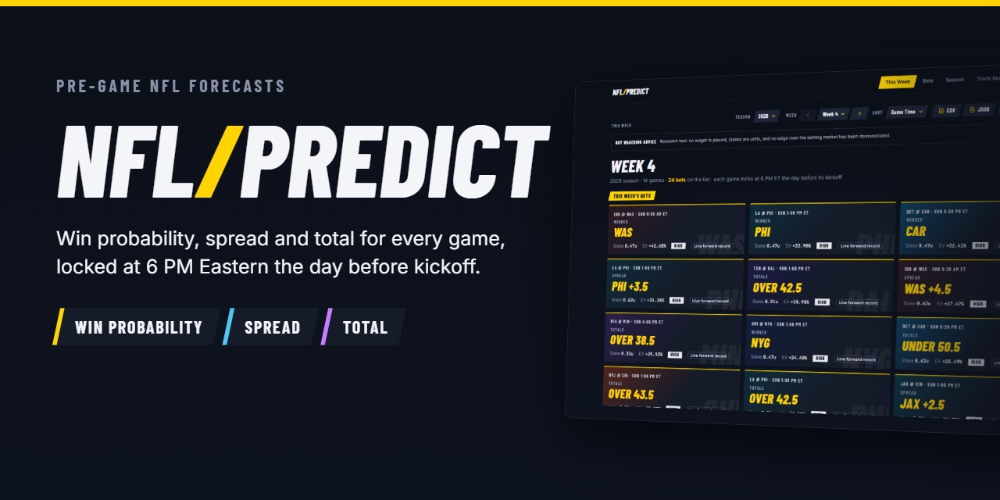
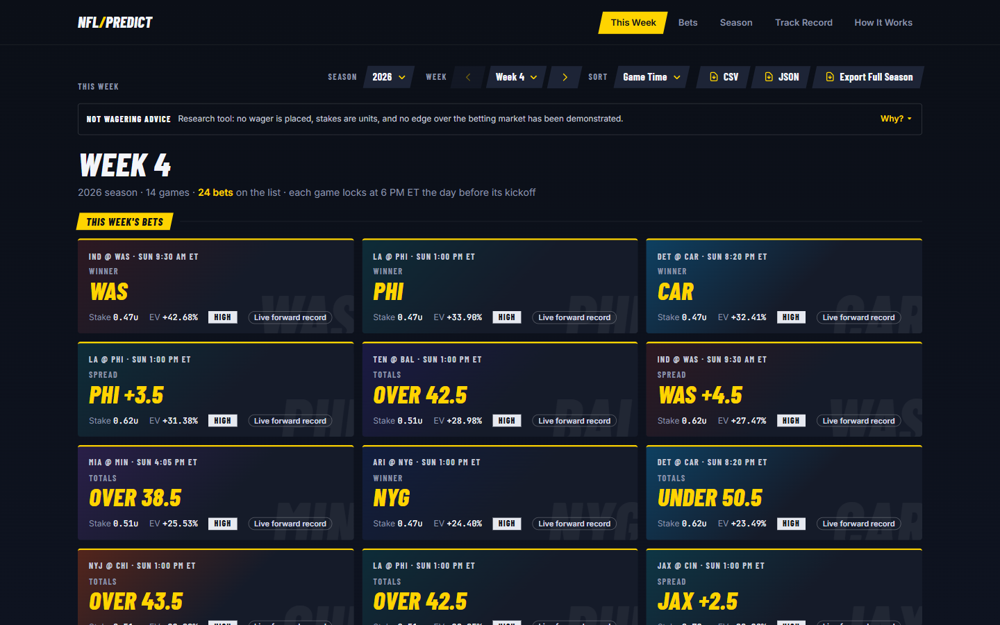
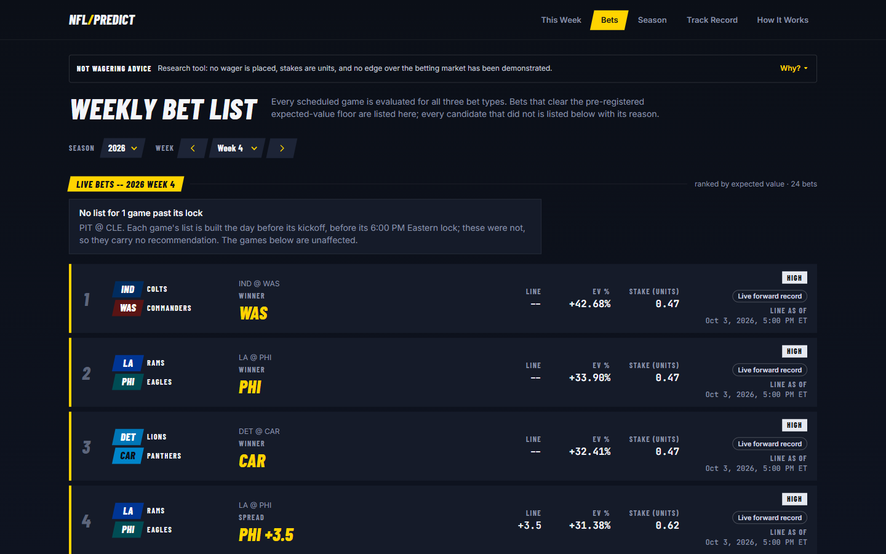
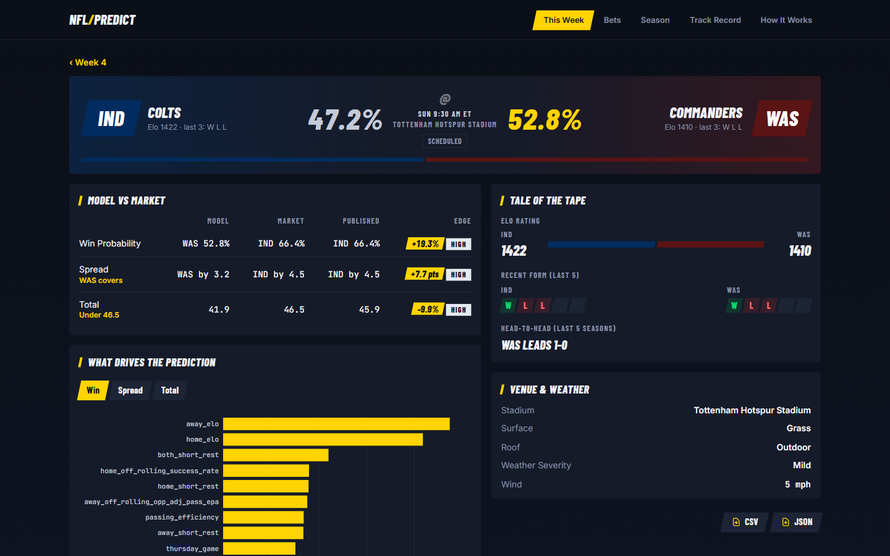
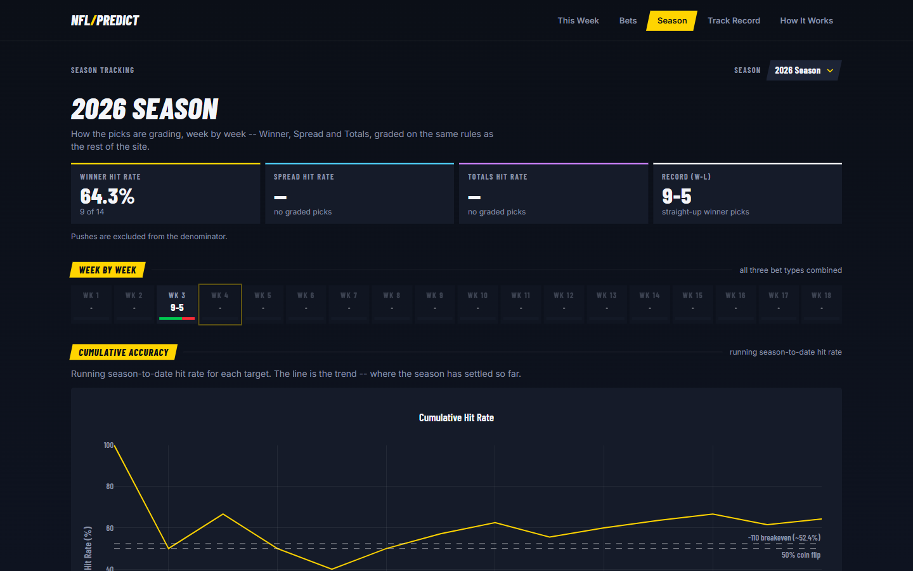
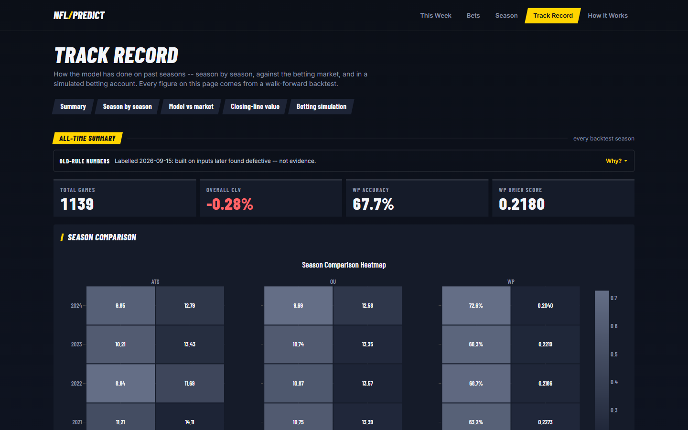
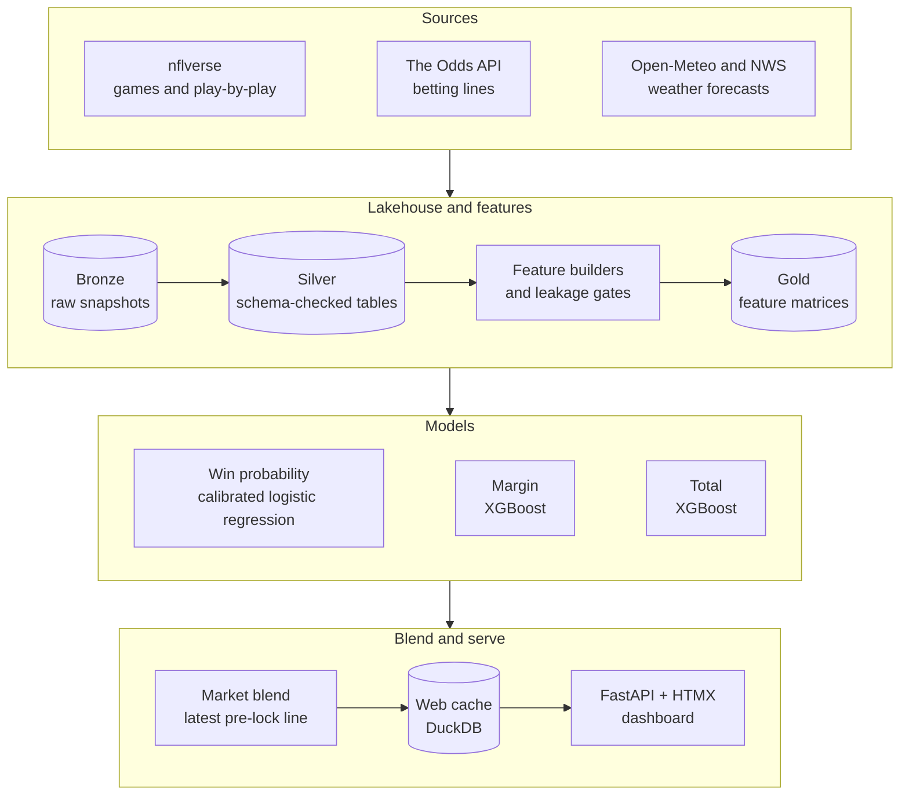

<p align="center">
  
</p>

<p align="center">
  <a href="https://github.com/jackc625/nfl-predict/actions/workflows/lint.yml"></a>
  
  
  
  
  
  
  
  <a href="LICENSE"></a>
</p>

# NFL/Predict

**Pre-game NFL forecasts -- win probability, point margin and total points -- built to be honest
about what they know, and when they knew it.**

NFL/Predict is an end-to-end machine-learning system. It ingests games, betting lines and weather,
builds leakage-checked features, trains three walk-forward models, blends them with the betting
market, and serves the results on a broadcast-style web dashboard. It is a personal research tool
and a portfolio project, and it is strict about one thing above all: no prediction may use
information that was not available at the time.

<p align="center">
  
</p>

## What it does

- **Three forecasts for every game.** Each team's chance of winning, the expected winning margin
  (set against the point spread) and the expected total points (set against the over/under). Each
  is shown beside the market's number for the same game, so disagreements stand out.
- **A fixed information deadline.** Every game's inputs lock at 6 PM Eastern on the day before
  kickoff. Anything known by then can be used; anything that arrives later cannot.
- **A weekly bet list.** Every game is evaluated for all three bet types. Bets that clear an
  expected-value threshold fixed before the season's first bet are ranked and sized in units, and
  every candidate that did not clear it is listed with its reason.
- **Game pages.** Model versus market, the inputs each model leans on most, a tale of the tape, and
  the venue and weather.
- **A live season record.** The Season page tracks the 2026 season as games are played. Past-season
  backtests are on the Track Record page, clearly labelled (see [Results, honestly](#results-honestly)).
- **Runs on its own.** A scheduled job runs every day at 5 PM Eastern, an hour before the lock:
  it collects fresh data, rebuilds features, predicts, builds the bet list and refreshes the site.
- **Exports.** Any week or season as CSV or JSON.

## Screenshots

<table>
  <tr>
    <td width="50%"><br><sub><b>Bets</b> -- the ranked weekly list, with every rejected candidate and its reason</sub></td>
    <td width="50%"><br><sub><b>Game page</b> -- model versus market, and the tale of the tape</sub></td>
  </tr>
  <tr>
    <td width="50%"><br><sub><b>Season</b> -- the 2026 season, tracked live</sub></td>
    <td width="50%"><br><sub><b>Track Record</b> -- past-season backtests, labelled as not evidence</sub></td>
  </tr>
</table>

## How it works (architecture)



1. **Ingest.** Games and play-by-play come from [nflverse](https://github.com/nflverse) via
   `nflreadpy`, betting lines from The Odds API, live weather forecasts from Open-Meteo, and
   historical day-before forecasts from archived National Weather Service bulletins. Historical
   games use the forecast as it stood at the lock, not the weather that actually happened.
2. **Store.** A bronze / silver / gold lakehouse in Parquet and DuckDB. Raw snapshots are kept
   append-only, and ingested rows are checked against Pydantic schemas: for games, weather, snap
   counts and injuries one bad row fails the whole batch, while the odds ingest drops a bad row
   with a warning.
3. **Build features.** Elo team ratings running since 2002, recent form, rest, travel and schedule,
   the venue, and the weather forecast at the lock. Betting lines are not model inputs: the models
   never see the market.
4. **Train.** Win probability comes from a calibrated logistic regression; the margin and the total
   each come from an XGBoost regressor. Training is walk-forward only -- a model is only ever tested
   on games played after everything it learned from -- with Optuna for hyperparameter search.
5. **Blend.** Each model's number is blended with the latest market line from before the lock (in
   log-odds for win probability, in points for the margin and total), using one fixed weight per
   prediction tuned on past seasons. The weight can be zero: where the market alone did at least as
   well, the published number is the market's own, and the model's number is shown beside it.
6. **Serve.** Everything the site shows is precomputed into a read-only DuckDB cache. The FastAPI +
   Jinja2 + HTMX app only reads that cache; no model code runs while a page is served.

## Engineering highlights

- **One lock rule.** The information deadline is defined once, in
  [`utils/game_lock.py`](utils/game_lock.py): information timed exactly at the lock is admissible;
  one second later is not.
- **Leakage defences in layers.** Every feature builder satisfies a `FeatureBuilder` protocol that
  requires an as-of time ([`features/protocol.py`](features/protocol.py)); an information-time gate
  checks every source's timestamps against each game's lock
  ([`features/provenance.py`](features/provenance.py)); a `LeakageGate` scans the combined matrix
  for post-game columns and checks Elo ordering ([`features/validation.py`](features/validation.py));
  and walk-forward splits refuse to run if training and test seasons overlap
  ([`models/temporal.py`](models/temporal.py)). The deployed models are tuned on season-ordered
  folds only (see [Current limitations](#current-limitations) for the legacy trainers).
- **Pre-registered, tamper-evident evaluation.** Decision rules -- the bet list's expected-value
  threshold, the significance tests -- are committed before the results they govern exist. Tests
  then use git history to check that the freezing commit really came first
  ([`tests/unit/test_preregistration_ancestry.py`](tests/unit/test_preregistration_ancestry.py)).
- **Reproducible inputs.** [`config/upstream_pin.json`](config/upstream_pin.json) records exactly
  which nflverse snapshot was used, with a SHA-256 for every season file.
- **A hard wall between serving and modelling.** The web app may not import model, feature or
  rating code; an AST-walking test fails the build if it ever does
  ([`tests/api/test_import_guard.py`](tests/api/test_import_guard.py)).
- **Honesty enforced by tests.** Every published readout is guarded by tests: results built on
  defective inputs must carry a dated "not evidence" label, and readouts may not use over-claiming
  words.

## Results, honestly

- **No model here has shown that it beats the betting market.**
- In September 2026, the inputs behind every earlier result were found to be defective -- for
  example, closing lines known only at kickoff had been used as model inputs, and missing weather
  had been filled with a flat placeholder. All three models were rebuilt from scratch on corrected
  inputs.
- Every earlier result -- the past-season backtests and the one-shot 2025 test -- stays in the
  record, unedited, and is labelled as built on inputs later found defective: not evidence.
- The only evidence that counts is the 2026 season, recorded live with every game locked at 6 PM
  Eastern the day before kickoff. The Season page shows it as it accumulates.

This is a personal research tool, not betting advice. A bet on the list cleared a threshold fixed
before the season; that is not a forecast that it will win.

## Current limitations

1. **No demonstrated edge.** No model has shown that it beats the betting market; the 2026 season
   is the first clean test (see [Results, honestly](#results-honestly)).
2. **One machine, on Eastern time.** The scheduled run is a Windows Task Scheduler task that
   expects the machine to stay on Eastern time. Hosted deployment is out of scope for now.
3. **Single-worker server.** The app shares one read-only DuckDB connection and an in-process
   cache, so it must run as a single uvicorn worker (`--workers 1`).
4. **Legacy trainers still in the tree.** The original `models/train_ats.py` and
   `models/train_ou.py` remain because the prediction path imports their distribution converters,
   and `models/train_wp.py` sits beside them. They contain k-fold grid and random search, but the
   deployed models are trained by `models/trainers/` on season-ordered folds only. Moving the
   converters out is a deferred refactor.

## Tech stack

| Area | Tools |
|---|---|
| Language and tooling | Python 3.13, uv, Ruff, Pyright, pytest, Hypothesis |
| Data | pandas, DuckDB, Parquet (pyarrow), Pydantic v2 |
| Modelling | scikit-learn, XGBoost, Optuna |
| Data sources | nflreadpy (nflverse), The Odds API, Open-Meteo, NWS forecast archive |
| Web | FastAPI, Jinja2, HTMX 2, Tailwind CSS v4, Plotly |
| Operations | Windows Task Scheduler, structlog, tenacity |

## Getting started

You need Python 3.12 or newer (developed on 3.13), [uv](https://docs.astral.sh/uv/), and a free
[The Odds API](https://the-odds-api.com/) key. Commands are shown for PowerShell on Windows, where
the project runs; on macOS or Linux use `cp` instead of `Copy-Item`.

```powershell
git clone https://github.com/jackc625/nfl-predict.git
cd nfl-predict
uv sync
Copy-Item .env.example .env   # then add your ODDS_API_KEY
```

The data and models are not committed. The full build runs in eight stages -- ingest, features,
train, promote, backtest, predict, cache and serve -- documented command by command in
[`docs/guides/PIPELINE.md`](docs/guides/PIPELINE.md); the first build pulls every season back to
2002. Once the cache exists, the site is one command:

```powershell
uv run uvicorn api.main:app --port 8000   # then open http://localhost:8000
```

The scheduled daily run is `uv run python scripts/daily_lock_pipeline.py`; see
[`docs/guides/AUTOMATION.md`](docs/guides/AUTOMATION.md) for what it does and how to tell a run
succeeded. Many tests read the locally built data, so run them after the first build.

## Project layout

```
api/          FastAPI app: pages, HTMX fragments, CSV/JSON exports, /health
audit/        independent Elo replay used to audit the ratings
backtest/     walk-forward backtests, betting simulation, pre-registered constants
conf/         settings and the season partition
config/       deploy-gate, pre-registration and data-correction configs; upstream data pins
data/         storage layer, schemas and quality gates (the data itself is not committed)
deployment/   Windows Task Scheduler task definition
docs/         guides, the records trail, and images
features/     feature builders, the information-time and leakage gates, normalisation
models/       trainers, calibration, market blending, the deploy gate, artifacts
pipeline/     the scheduled orchestrator: steps, health checks, alerts
ratings/      Elo ratings
scripts/      command-line entry points for every pipeline stage
tests/        unit, integration and API tests
utils/        the lock rule, team data, dates, probability and Kelly-sizing helpers
web/          Jinja2 templates, Tailwind CSS, fonts
```

## Documentation

**Guides** -- how the system works and how to run it

- [`PIPELINE.md`](docs/guides/PIPELINE.md) -- the canonical run sequence, stage by stage
- [`RUNBOOK.md`](docs/guides/RUNBOOK.md) -- operator runbook: setup, each operation, recovery
- [`AUTOMATION.md`](docs/guides/AUTOMATION.md) -- what the scheduled daily run does
- [`METHODOLOGY.md`](docs/guides/METHODOLOGY.md) -- modelling and feature-engineering deep dive
- [`STATE-OF-SYSTEM.md`](docs/guides/STATE-OF-SYSTEM.md) -- what is trustworthy, fixed and deferred

**Records** -- the paper trail, in [`docs/records/`](docs/records/): data and feature audits,
accuracy diagnoses, every model re-fit and its gate decision, signal screens, the 2025
profitability readout, and the corrections made under the day-before lock. Results reported there
from before the September 2026 fix carry a dated label saying they are not evidence.

**Frozen records** -- kept at the top level because their git history is the proof that each rule
was fixed before its results existed:

- [`PROFITABILITY-PREREGISTRATION.md`](PROFITABILITY-PREREGISTRATION.md) -- the 2025 test, registered in advance
- [`COLD-START-PREREGISTRATION.md`](COLD-START-PREREGISTRATION.md) -- the original 2026 bet rule
- [`COLD-START-CORRECTION.md`](COLD-START-CORRECTION.md) and
  [`NEUTRAL-HFA-BET-RULE-CORRECTION.md`](NEUTRAL-HFA-BET-RULE-CORRECTION.md) -- the corrections that superseded it
- [`EV-CHAIN-CORRECTION.md`](EV-CHAIN-CORRECTION.md) -- the expected-value floor, re-derived
- [`MOS-DECODE-COMPARISON.md`](MOS-DECODE-COMPARISON.md) -- the check behind the historical forecast decoding

## Disclaimer

Informational only, not betting advice. Not affiliated with or endorsed by the NFL or any team.

## License

[MIT](LICENSE) -- Copyright (c) 2025-2026 Jack Cutrara
