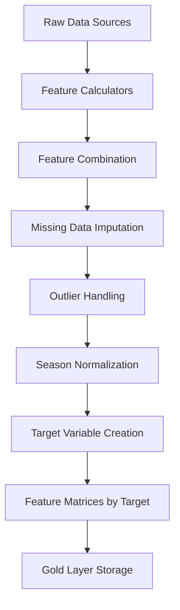

# NFL Prediction System - Feature Engineering Documentation

> **Note:** This document was written during a prior development effort and predates the current
> roadmap. Some information may be outdated or incorrect. See `.planning/` for the authoritative
> project documentation, architecture decisions, and current development state.

This document provides comprehensive documentation for the feature engineering pipeline of the NFL Prediction System, including all feature categories, calculation methods, validation procedures, and best practices.

## Table of Contents

1. [Overview](#overview)
2. [Feature Categories](#feature-categories)
3. [Data Pipeline](#data-pipeline)
4. [Feature Calculation Details](#feature-calculation-details)
5. [Data Leakage Prevention](#data-leakage-prevention)
6. [Feature Validation](#feature-validation)
7. [Target Variable Engineering](#target-variable-engineering)
8. [Performance Considerations](#performance-considerations)
9. [Usage Examples](#usage-examples)

---

## Overview

The NFL Prediction System uses a comprehensive feature engineering pipeline that combines multiple data sources to create predictive features for three distinct prediction tasks:

### Prediction Targets
1. **Win Probability (WP)**: Probability that home team wins
2. **Against the Spread (ATS)**: Probability that home team covers the spread
3. **Over/Under (O/U)**: Probability that total points exceed the line

### Core Principles
- **No Data Leakage**: Only historical data used for each prediction
- **Temporal Consistency**: Features respect game timing and information availability
- **Missing Data Handling**: Robust imputation and fallback strategies
- **Normalization**: Season-aware z-score normalization
- **Validation**: Comprehensive data quality and distribution checks

---

## Feature Categories

### 1. Team Form Metrics
**Purpose**: Capture recent team performance trends
**Source**: Play-by-play data from nflreadpy (previously nfl_data_py, replaced in Phase 1)
**Lookback**: Rolling 4-week window

#### Offensive Metrics
- `home_off_rolling_epa_per_play`: EPA per play (last 4 weeks)
- `home_off_rolling_success_rate`: Success rate percentage
- `home_off_rolling_pass_rate_neutral`: Pass rate in neutral situations
- `home_off_rolling_third_down_conv`: Third down conversion rate

#### Defensive Metrics
- `home_def_rolling_epa_per_play`: EPA allowed per play
- `home_def_rolling_success_rate`: Defensive success rate
- `home_def_rolling_pass_rate_allowed`: Pass rate allowed
- `home_def_rolling_third_down_stop`: Third down stop rate

#### Calculation Logic
```python
# Rolling 4-week EPA calculation
def calculate_rolling_epa(team_games: pd.DataFrame, current_date: datetime) -> float:
    """Calculate rolling 4-week EPA for team."""
    cutoff_date = current_date - timedelta(weeks=4)
    recent_games = team_games[team_games['game_date'] >= cutoff_date]

    # Weight by recency (more recent games weighted higher)
    weights = np.exp(-0.1 * (current_date - recent_games['game_date']).dt.days)

    return np.average(recent_games['epa_per_play'], weights=weights)
```

### 2. Elo Rating System
**Purpose**: Capture long-term team strength with uncertainty
**Source**: Historical game results
**Updates**: After each game with margin-of-victory adjustment

#### Elo Features
- `home_elo_rating`: Current Elo rating (home team)
- `away_elo_rating`: Current Elo rating (away team)
- `elo_diff`: Home minus away Elo difference
- `home_elo_uncertainty`: Rating uncertainty measure
- `elo_home_advantage`: Dynamic home field advantage

#### Elo Calculation
```python
def update_elo_rating(
    winner_elo: float,
    loser_elo: float,
    margin: int,
    k_factor: float = 20.0
) -> Tuple[float, float]:
    """Update Elo ratings based on game result."""

    # Expected probability
    expected_prob = 1 / (1 + 10**((loser_elo - winner_elo) / 400))

    # Margin-of-victory multiplier
    mov_multiplier = np.log(abs(margin) + 1)

    # Rating updates
    winner_change = k_factor * mov_multiplier * (1 - expected_prob)
    loser_change = -winner_change

    return winner_elo + winner_change, loser_elo + loser_change
```

### 3. Contextual Features
**Purpose**: Capture situational factors affecting performance
**Source**: Game metadata, schedule data

#### Travel & Rest
- `home_rest_days`: Days since last game (home team)
- `away_rest_days`: Days since last game (away team)
- `rest_advantage`: Difference in rest days
- `away_travel_distance`: Miles traveled by away team
- `away_timezone_change`: Timezone difference for away team

#### Venue & Timing
- `venue_elevation`: Stadium elevation (feet above sea level)
- `venue_roof_type`: Dome/retractable/open (encoded)
- `venue_surface`: Grass/turf/hybrid (encoded)
- `game_hour_local`: Local game start hour
- `is_primetime`: Monday/Thursday/Sunday night games
- `is_playoff_contention`: Late season games with playoff implications

#### Division & Rivalry
- `is_division_game`: Same division matchup
- `is_conference_game`: Same conference matchup
- `historical_head_to_head`: Recent H2H record (last 5 games)

### 4. Weather Features
**Purpose**: Account for weather impact on scoring and game flow
**Source**: Open-Meteo weather data (previously Meteostat, replaced in Phase 1)
**Scope**: Outdoor stadiums only

#### Weather Metrics
- `temp_f`: Game-time temperature (Fahrenheit)
- `wind_speed_mph`: Wind speed at kickoff
- `humidity_pct`: Relative humidity percentage
- `precipitation_mm`: Expected precipitation
- `weather_severity_index`: Composite weather impact score

#### Weather Impact Modeling
```python
def calculate_weather_impact(temp: float, wind: float, precip: float) -> float:
    """Calculate composite weather severity impact."""

    # Temperature impact (extreme cold/heat)
    temp_impact = max(0, abs(temp - 70) - 20) / 10

    # Wind impact (exponential above 10 mph)
    wind_impact = max(0, wind - 10) ** 1.5 / 10

    # Precipitation impact
    precip_impact = min(precip / 5, 1.0)  # Cap at 5mm

    return np.sqrt(temp_impact**2 + wind_impact**2 + precip_impact**2)
```

### 5. Market Anchor Features
**Purpose**: Incorporate market wisdom and betting line movement
**Source**: Sports betting APIs
**Timing**: Friday 6:00 PM ET snapshot

#### Betting Lines
- `market_spread`: Point spread (home team perspective)
- `market_total`: Over/under total points
- `market_moneyline_home`: Home team moneyline odds
- `market_moneyline_away`: Away team moneyline odds

#### Derived Market Features
- `implied_prob_home`: Devigged win probability from moneyline
- `implied_prob_spread`: Spread-based win probability
- `implied_total_over`: Over probability from total line
- `line_movement_spread`: Change from opening to current spread
- `line_movement_total`: Change from opening to current total

#### Devigging Calculation
```python
def devigge_moneyline(home_odds: float, away_odds: float) -> Tuple[float, float]:
    """Remove bookmaker vig from moneyline odds."""

    # Convert to probabilities
    home_prob = odds_to_probability(home_odds)
    away_prob = odds_to_probability(away_odds)

    # Remove vig proportionally
    total_prob = home_prob + away_prob
    home_fair = home_prob / total_prob
    away_fair = away_prob / total_prob

    return home_fair, away_fair
```

---

## Data Pipeline

### Feature Building Workflow



### Processing Steps

#### 1. Data Loading
```python
# Load all required data sources
games_df = load_dataframe('games', layer='silver')
odds_df = load_dataframe('odds_snapshot', layer='silver')
weather_df = load_dataframe('weather', layer='silver')
pbp_df = load_dataframe('play_by_play', layer='silver')
```

#### 2. Feature Calculation
```python
# Calculate each feature category
team_form = TeamFormCalculator().calculate_features(games_df, pbp_df)
elo_features = EloFeatureBuilder().build_elo_features(games_df)
contextual = ContextualFeaturesCalculator().calculate_features(games_df)
weather = WeatherFeaturesCalculator().calculate_features(weather_df)
market = MarketAnchorFeaturesCalculator().calculate_features(odds_df)
```

#### 3. Feature Combination
```python
# Merge all features on game_id
feature_df = games_df.merge(team_form, on='game_id', how='left')
feature_df = feature_df.merge(elo_features, on='game_id', how='left')
feature_df = feature_df.merge(contextual, on='game_id', how='left')
feature_df = feature_df.merge(weather, on='game_id', how='left')
feature_df = feature_df.merge(market, on='game_id', how='left')
```

#### 4. Data Quality Processing
```python
# Handle missing data
feature_df = handle_missing_data(feature_df)

# Winsorize outliers (1% and 99% percentiles)
feature_df = winsorize_outliers(feature_df, limits=[0.01, 0.01])

# Normalize within seasons
feature_df = normalize_features_by_season(feature_df)
```

---

## Feature Calculation Details

### Team Form Calculator

#### EPA Calculation
```python
class TeamFormCalculator:
    def calculate_rolling_epa(
        self,
        team: str,
        current_date: datetime,
        weeks: int = 4
    ) -> Dict[str, float]:
        """Calculate rolling EPA metrics for team."""

        # Get team's recent games
        cutoff_date = current_date - timedelta(weeks=weeks)
        team_games = self.pbp_data[
            (self.pbp_data['posteam'] == team) &
            (self.pbp_data['game_date'] >= cutoff_date) &
            (self.pbp_data['game_date'] < current_date)
        ].copy()

        if len(team_games) == 0:
            return self._get_default_values()

        # Calculate weighted averages (recent games weighted more)
        days_ago = (current_date - team_games['game_date']).dt.days
        weights = np.exp(-0.05 * days_ago)  # 5% decay per day

        return {
            'epa_per_play': np.average(team_games['epa'], weights=weights),
            'success_rate': np.average(team_games['success'], weights=weights),
            'pass_rate_neutral': self._calc_neutral_pass_rate(team_games, weights)
        }
```

#### Success Rate Definition
- **Offensive Success**: Positive EPA gain on play
- **Defensive Success**: Negative EPA allowed on play
- **Neutral Situations**: 1st/2nd down, 5+ yards to go, not in red zone

### Elo Rating System

#### Dynamic K-Factor
```python
def get_k_factor(
    game_importance: float,
    season_progress: float,
    elo_diff: float
) -> float:
    """Calculate dynamic K-factor based on game context."""

    base_k = 20.0

    # Increase for important games
    importance_multiplier = 1 + (game_importance * 0.5)

    # Increase early in season (more uncertainty)
    season_multiplier = 1 + (0.3 * (1 - season_progress))

    # Increase for mismatched teams (upset potential)
    mismatch_multiplier = 1 + min(abs(elo_diff) / 400, 0.3)

    return base_k * importance_multiplier * season_multiplier * mismatch_multiplier
```

#### Home Field Advantage
```python
def calculate_home_advantage(
    venue: str,
    season: int,
    week: int
) -> float:
    """Calculate dynamic home field advantage."""

    # Base home advantage (varies by stadium)
    base_hfa = VENUE_HOME_ADVANTAGES.get(venue, 57.0)  # Default ~2.8 point advantage

    # Reduce in playoffs (neutral sites)
    if week > 18:
        base_hfa *= 0.3

    # Weather impact (some venues benefit more)
    weather_bonus = VENUE_WEATHER_FACTORS.get(venue, 1.0)

    return base_hfa * weather_bonus
```

### Weather Impact Modeling

#### Scoring Impact
```python
def predict_weather_scoring_impact(
    temp: float,
    wind: float,
    precip: float,
    venue_type: str
) -> Dict[str, float]:
    """Predict weather impact on scoring."""

    if venue_type in ['dome', 'retractable_closed']:
        return {'scoring_factor': 1.0, 'pass_factor': 1.0}

    # Temperature impact on scoring
    if temp < 32:  # Freezing
        scoring_factor = 0.85 - (32 - temp) * 0.01
    elif temp > 85:  # Hot weather
        scoring_factor = 0.95 - (temp - 85) * 0.005
    else:
        scoring_factor = 1.0

    # Wind impact on passing
    if wind > 15:
        pass_factor = 0.9 - (wind - 15) * 0.02
        scoring_factor *= (0.95 - (wind - 15) * 0.01)
    else:
        pass_factor = 1.0

    # Precipitation impact
    if precip > 2:  # Significant precipitation
        scoring_factor *= 0.9
        pass_factor *= 0.85

    return {
        'scoring_factor': max(scoring_factor, 0.6),  # Floor at 60%
        'pass_factor': max(pass_factor, 0.7)         # Floor at 70%
    }
```

---

## Data Leakage Prevention

### Temporal Constraints

#### Strict Time Ordering
```python
def ensure_no_leakage(
    features_df: pd.DataFrame,
    prediction_date: datetime
) -> pd.DataFrame:
    """Ensure no future data leaks into features."""

    # Only use data strictly before prediction time
    valid_data = features_df[
        features_df['data_as_of'] < prediction_date
    ].copy()

    # Remove any post-game statistics
    future_stats = [
        'final_score_home', 'final_score_away',
        'actual_margin', 'game_result',
        'post_game_elo', 'actual_total'
    ]

    return valid_data.drop(columns=future_stats, errors='ignore')
```

#### Rolling Calculations
```python
def calculate_rolling_metric(
    team_data: pd.DataFrame,
    current_game_date: datetime,
    metric_col: str,
    windows: int = 4
) -> float:
    """Calculate rolling metric without data leakage."""

    # Only use games BEFORE current game
    historical_games = team_data[
        team_data['game_date'] < current_game_date
    ].sort_values('game_date')

    if len(historical_games) < 2:
        return np.nan

    # Take last N games
    recent_games = historical_games.tail(windows)

    # Calculate metric
    return recent_games[metric_col].mean()
```

### Validation Checks

#### Data Leakage Detection
```python
def detect_data_leakage(
    features_df: pd.DataFrame,
    target_col: str
) -> Dict[str, Any]:
    """Detect potential data leakage in features."""

    results = {
        'leakage_detected': False,
        'suspicious_features': [],
        'correlation_issues': []
    }

    # Check for perfect correlations
    correlations = features_df.corrwith(features_df[target_col])
    perfect_corr = correlations[abs(correlations) > 0.95].index.tolist()

    if perfect_corr:
        results['leakage_detected'] = True
        results['suspicious_features'] = perfect_corr

    # Check for impossible future dates
    date_cols = features_df.select_dtypes(include=['datetime']).columns
    for col in date_cols:
        future_dates = features_df[features_df[col] > datetime.now()]
        if len(future_dates) > 0:
            results['leakage_detected'] = True
            results['correlation_issues'].append(f"Future dates in {col}")

    return results
```

---

## Feature Validation

### Distribution Validation

#### Feature Stability Check
```python
def validate_feature_stability(
    features_df: pd.DataFrame,
    feature_col: str,
    season_col: str = 'season'
) -> Dict[str, float]:
    """Validate feature distribution stability across seasons."""

    stability_metrics = {}

    # Calculate mean and std by season
    season_stats = features_df.groupby(season_col)[feature_col].agg(['mean', 'std'])

    # Check for distribution drift
    stability_metrics['mean_stability'] = season_stats['mean'].std()
    stability_metrics['std_stability'] = season_stats['std'].std()

    # Check for outliers
    q1, q3 = features_df[feature_col].quantile([0.25, 0.75])
    iqr = q3 - q1
    outlier_threshold = q3 + 1.5 * iqr
    outlier_rate = (features_df[feature_col] > outlier_threshold).mean()
    stability_metrics['outlier_rate'] = outlier_rate

    return stability_metrics
```

#### Missing Data Analysis
```python
def analyze_missing_data(features_df: pd.DataFrame) -> pd.DataFrame:
    """Analyze missing data patterns."""

    missing_analysis = pd.DataFrame({
        'feature': features_df.columns,
        'missing_count': features_df.isnull().sum(),
        'missing_pct': features_df.isnull().mean() * 100
    })

    # Check for systematic missingness
    missing_analysis['is_systematic'] = missing_analysis['missing_pct'] > 5.0

    # Analyze missingness by season
    seasonal_missing = features_df.groupby('season').apply(
        lambda x: x.isnull().mean() * 100
    )

    return missing_analysis.sort_values('missing_pct', ascending=False)
```

---

## Target Variable Engineering

### Win Probability Target
```python
def create_wp_target(games_df: pd.DataFrame) -> pd.Series:
    """Create win probability target variable."""

    # Home team wins = 1, away team wins = 0
    wp_target = (games_df['score_home'] > games_df['score_away']).astype(int)

    # Handle ties (very rare in modern NFL)
    ties = games_df['score_home'] == games_df['score_away']
    wp_target[ties] = 0.5

    return wp_target
```

### ATS Target
```python
def create_ats_target(games_df: pd.DataFrame) -> pd.Series:
    """Create against-the-spread target variable."""

    # Calculate actual margin (home perspective)
    actual_margin = games_df['score_home'] - games_df['score_away']

    # Get spread (home perspective)
    spread = games_df['spread_line']

    # Home team covers = 1, away team covers = 0
    ats_target = (actual_margin > spread).astype(int)

    # Handle pushes
    pushes = actual_margin == spread
    ats_target[pushes] = 0.5

    return ats_target
```

### Over/Under Target
```python
def create_ou_target(games_df: pd.DataFrame) -> pd.Series:
    """Create over/under target variable."""

    # Calculate actual total
    actual_total = games_df['score_home'] + games_df['score_away']

    # Get market total
    market_total = games_df['total_line']

    # Over = 1, under = 0
    ou_target = (actual_total > market_total).astype(int)

    # Handle pushes
    pushes = actual_total == market_total
    ou_target[pushes] = 0.5

    return ou_target
```

---

## Performance Considerations

### Computational Efficiency

#### Vectorized Operations
```python
# Efficient rolling calculations
def calculate_rolling_efficiently(df: pd.DataFrame, window: int = 4) -> pd.DataFrame:
    """Calculate rolling metrics efficiently using pandas."""

    # Sort by team and date
    df_sorted = df.sort_values(['team', 'game_date'])

    # Use pandas rolling with time-based window
    rolling_metrics = df_sorted.groupby('team').rolling(
        window=window,
        min_periods=2
    ).agg({
        'epa_per_play': 'mean',
        'success_rate': 'mean',
        'pass_rate': 'mean'
    })

    return rolling_metrics.reset_index()
```

#### Memory Management
```python
def process_features_in_chunks(
    data_source: str,
    chunk_size: int = 1000
) -> pd.DataFrame:
    """Process large datasets in chunks to manage memory."""

    all_features = []

    for chunk in pd.read_parquet(data_source, chunksize=chunk_size):
        # Process chunk
        chunk_features = calculate_features(chunk)
        all_features.append(chunk_features)

        # Clear memory
        del chunk

    return pd.concat(all_features, ignore_index=True)
```

### Caching Strategy

#### Feature Caching
```python
def cached_feature_calculation(
    cache_key: str,
    calculation_func: callable,
    **kwargs
) -> pd.DataFrame:
    """Cache expensive feature calculations."""

    cache_file = Path(f"cache/features/{cache_key}.parquet")

    if cache_file.exists():
        # Check if cache is fresh (within 24 hours)
        if (datetime.now() - datetime.fromtimestamp(
            cache_file.stat().st_mtime)).seconds < 86400:
            return pd.read_parquet(cache_file)

    # Calculate features
    features = calculation_func(**kwargs)

    # Save to cache
    cache_file.parent.mkdir(parents=True, exist_ok=True)
    features.to_parquet(cache_file)

    return features
```

---

## Usage Examples

### Complete Feature Pipeline
```python
from scripts.build_features import FeatureMatrixBuilder

# Initialize builder
builder = FeatureMatrixBuilder()

# Build features for current week
features = builder.generate_feature_matrices(
    season=2024,
    week=3,
    save_output=True
)

# Access different target matrices
wp_features = features['wp']
ats_features = features['ats']
ou_features = features['ou']
```

### Individual Feature Calculators
```python
from features import TeamFormCalculator, EloFeatureBuilder

# Calculate team form metrics
team_form = TeamFormCalculator()
form_features = team_form.calculate_features(
    games_df=games_data,
    pbp_df=play_by_play_data
)

# Calculate Elo features
elo_builder = EloFeatureBuilder()
elo_features = elo_builder.build_elo_features(games_data)
```

### Feature Validation
```python
from features.validation import FeatureValidator

# Validate features
validator = FeatureValidator()

# Check for data leakage
leakage_report = validator.detect_data_leakage(features_df, 'target_wp')

# Validate distributions
distribution_report = validator.validate_feature_distributions(features_df)

# Generate comprehensive report
validation_report = validator.generate_validation_report(features_df)
```

### Custom Feature Addition
```python
def add_custom_feature(features_df: pd.DataFrame) -> pd.DataFrame:
    """Add custom feature to existing feature matrix."""

    # Calculate custom metric
    features_df['custom_metric'] = (
        features_df['home_elo_rating'] * 0.6 +
        features_df['home_off_rolling_epa_per_play'] * 100
    )

    # Normalize within seasons
    features_df['custom_metric_norm'] = features_df.groupby('season')[
        'custom_metric'
    ].transform(lambda x: (x - x.mean()) / x.std())

    return features_df
```

---

## Best Practices

### Feature Engineering Guidelines

1. **Temporal Awareness**: Always respect game timing and data availability
2. **Missing Data Strategy**: Use domain-specific imputation methods
3. **Normalization**: Normalize within seasons to account for rule changes
4. **Validation**: Continuously monitor feature distributions and correlations
5. **Documentation**: Document all feature calculations and assumptions

### Common Pitfalls to Avoid

1. **Look-ahead Bias**: Using future information in historical features
2. **Selection Bias**: Only including successful teams in feature calculations
3. **Overfitting**: Creating too many correlated features
4. **Scale Differences**: Mixing normalized and raw features
5. **Missing Data Ignorance**: Not handling systematic missingness patterns

---

**Last Updated**: 2024-09-15
**Feature Pipeline Version**: 1.0
**Total Features**: 89 (31 WP, 29 ATS, 29 O/U)