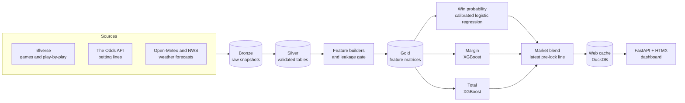

# Public Repo Facelift Implementation Plan

> **For agentic workers:** REQUIRED SUB-SKILL: Use superpowers:subagent-driven-development (recommended) or superpowers:executing-plans to implement this plan task-by-task. Steps use checkbox (`- [ ]`) syntax for tracking.

**Goal:** Make the public GitHub page for `jackc625/nfl-predict` professional: a fresh README with banner, badges and screenshots, an MIT LICENSE, a lint CI badge, a tidy repo root (22 reports moved into `docs/`), and a refreshed About box.

**Architecture:** Documentation and repo-metadata work only; no production code path changes. The 22 movable reports move with `git mv` into `docs/guides/` and `docs/records/`; tests that open them get the new paths, tests that read OLD commits keep the root names, and a small `tests/doc_locations.py` resolves a report's location from its bare name for the two tests that look names up dynamically. Images are captured from the running app with Playwright.

**Tech Stack:** Markdown (GitHub-flavoured, Mermaid), Python 3.13 / pytest, uv, Ruff, GitHub Actions, Playwright (MCP browser tools), shields.io badges.

**Spec:** `docs/superpowers/specs/2026-10-04-repo-facelift-design.md`

## Global Constraints

- Work only in the worktree `C:\Users\jackc\Code\nfl-predict\.claude\worktrees\repo-facelift` on branch `repo-facelift`. Never edit the main checkout until Task 7.
- Shell: Git Bash via the Bash tool. Every command starts with `cd /c/Users/jackc/Code/nfl-predict/.claude/worktrees/repo-facelift &&`. Use plain `git` (never the `rtk` prefix).
- NEVER run a bare `pytest` or a directory sweep. Run only the explicit file lists named in each task.
- Every new or edited text file is ASCII only, no emoji (CLAUDE.md; `CLAUDE.md` itself is ASCII-guarded by `tests/unit/test_one_lock_rule_source_scan.py`).
- No file this branch touches may contain the phrases listed in `tests/phase33_state.FORBIDDEN_SUITE_CLAIM_PHRASES` (they are suite-claim phrases about a failure count of zero). `tests/unit/test_phase33_no_zero_failures_claim.py` scans every file in the branch's diff, including this plan, the spec, the README and the moved docs.
- Never edit, and never `git mv`, these six history-anchored root records: `PROFITABILITY-PREREGISTRATION.md`, `COLD-START-PREREGISTRATION.md`, `COLD-START-CORRECTION.md`, `NEUTRAL-HFA-BET-RULE-CORRECTION.md`, `EV-CHAIN-CORRECTION.md`, `MOS-DECODE-COMPARISON.md`.
- Never edit these hash-locked / append-once files even though they name moved docs: `conf/season_partition.py`, `config/group_gate_verdict.toml`, `config/tuning_preregistration.py`, `config/mos_tolerance.py`, `backtest/ev_chain_constants.py`, `backtest/corrected_cold_start_constants.py`, `tests/phase30_state.py`, `tests/phase31_state.py`, `tests/phase33_state.py`.
- Moved documents move byte-identical (`git mv`, no content edits). Bare-filename prose mentions ("see PIPELINE.md") in code comments/docstrings are NOT rewritten.
- `.planning/` is not touched. `HANDOFF.md` and `MEMPALACE_GSD_SETUP.md` (untracked, main checkout) are not touched.
- The README quotes NO model accuracy or betting figure from before the 2026-09-15 fix.
- Commit messages end with:
  ```
  Co-Authored-By: Claude Opus 5.5 <noreply@anthropic.com>
  Claude-Session: https://claude.ai/code/session_01XGXaQ4mmgm9kTabYWKmti7
  ```
- Pushing to GitHub and `gh repo edit` happen ONLY after the owner approves them (Task 8).

## The verification test list (used in Tasks 1, 3, 5, 7)

Shell state does not persist between commands, so EVERY command below that mentions `$SCRATCH`
first sets it, exactly like this:

```bash
SCRATCH=/c/Users/jackc/AppData/Local/Temp/claude/C--Users-jackc-Code-nfl-predict/3e82d9e9-10b1-47dd-a026-3e4cbe12dc55/scratchpad
```

Task 1 Step 1.0 writes the list below, one path per line, to `$SCRATCH/facelift_tests.txt`; every
test run then reads it with `$(cat "$SCRATCH/facelift_tests.txt")`:

```bash
FACELIFT_TESTS="tests/unit/test_old_rule_labels.py tests/unit/test_readme_claude_reconciled.py tests/unit/test_profitability_readout_md.py tests/unit/test_methodology_md.py tests/unit/test_automation_md.py tests/unit/test_pipeline_md.py tests/unit/test_runbook_md.py tests/unit/test_state_of_system_md.py tests/unit/test_blend_tuning_readout_md.py tests/unit/test_closing_line_audit_md.py tests/unit/test_gated_refit_readout_md.py tests/unit/test_historical_weather_readout_md.py tests/unit/test_line_movement_readout_md.py tests/unit/test_group_verdict_remeasured.py tests/unit/test_ou_divergence_diagnosis_md.py tests/unit/test_phase33_readout_md.py tests/unit/test_refit_readout_md.py tests/unit/test_signal_lift_readout_md.py tests/unit/test_weather_null_list_md.py tests/integration/test_no_precoverage_constants.py tests/unit/test_phase33_no_zero_failures_claim.py tests/unit/test_one_lock_rule_source_scan.py tests/unit/test_preregistration_ancestry.py tests/unit/test_phase33_preregistration_ancestry.py tests/unit/test_mos_tolerance_ancestry.py tests/unit/test_superseding_correction.py tests/unit/test_ev_chain_correction.py tests/unit/test_ev_chain_correction_md.py tests/unit/test_evidence_skip_visibility.py"
```

Scratch output directory: `C:\Users\jackc\AppData\Local\Temp\claude\C--Users-jackc-Code-nfl-predict\3e82d9e9-10b1-47dd-a026-3e4cbe12dc55\scratchpad` (Git Bash: `/c/Users/jackc/AppData/Local/Temp/claude/C--Users-jackc-Code-nfl-predict/3e82d9e9-10b1-47dd-a026-3e4cbe12dc55/scratchpad`), referred to below as `$SCRATCH`.

## Review Focus

- A history read silently switched to a new path: `git show <sha> -- <path>` or a commit numstat compared on a path that did not exist at that commit returns nothing and the check passes vacuously. Task 3 keeps `tests/unit/test_line_movement_readout_md.py:705` and `_labelling_numstat` on the root names and re-reads both by hand.
- A moved report read as "missing" and therefore skipped: `test_profitability_readout_md.py` treats an absent figure source as `None` (citation-only, value check skipped). Task 3 routes every source through `doc_path` and Step 3.9 asserts each source resolves to an existing file.
- A README claim that is not true of the code today (pages, data sources, the lock time, what the blend does, where live results appear). Task 5 Step 5.3 checks each claim against the named file.
- A screenshot exposing something unintended (an error state, an empty panel, a local filesystem path, a stale-cache banner). Task 4 Step 4.6 reviews every image before commit.
- A badge or image path that renders on GitHub as broken (relative paths, shields.io escaping of `-` and spaces, the workflow badge before the workflow exists on `master`). Task 5 Step 5.4 checks every URL; Task 8 re-checks on the live page.

---

### Task 1: Baseline the verification test list

**Files:** none modified. Output: `$SCRATCH/facelift_tests.txt`, `$SCRATCH/baseline.txt`.

- [ ] **Step 1.0: Write the test list file**

```bash
SCRATCH=/c/Users/jackc/AppData/Local/Temp/claude/C--Users-jackc-Code-nfl-predict/3e82d9e9-10b1-47dd-a026-3e4cbe12dc55/scratchpad && FACELIFT_TESTS="tests/unit/test_old_rule_labels.py tests/unit/test_readme_claude_reconciled.py tests/unit/test_profitability_readout_md.py tests/unit/test_methodology_md.py tests/unit/test_automation_md.py tests/unit/test_pipeline_md.py tests/unit/test_runbook_md.py tests/unit/test_state_of_system_md.py tests/unit/test_blend_tuning_readout_md.py tests/unit/test_closing_line_audit_md.py tests/unit/test_gated_refit_readout_md.py tests/unit/test_historical_weather_readout_md.py tests/unit/test_line_movement_readout_md.py tests/unit/test_group_verdict_remeasured.py tests/unit/test_ou_divergence_diagnosis_md.py tests/unit/test_phase33_readout_md.py tests/unit/test_refit_readout_md.py tests/unit/test_signal_lift_readout_md.py tests/unit/test_weather_null_list_md.py tests/integration/test_no_precoverage_constants.py tests/unit/test_phase33_no_zero_failures_claim.py tests/unit/test_one_lock_rule_source_scan.py tests/unit/test_preregistration_ancestry.py tests/unit/test_phase33_preregistration_ancestry.py tests/unit/test_mos_tolerance_ancestry.py tests/unit/test_superseding_correction.py tests/unit/test_ev_chain_correction.py tests/unit/test_ev_chain_correction_md.py tests/unit/test_evidence_skip_visibility.py" && printf '%s\n' $FACELIFT_TESTS > "$SCRATCH/facelift_tests.txt" && wc -l "$SCRATCH/facelift_tests.txt" && cd /c/Users/jackc/Code/nfl-predict/.claude/worktrees/repo-facelift && for f in $(cat "$SCRATCH/facelift_tests.txt"); do test -f "$f" || echo "MISSING $f"; done
```
Expected: `29` lines and no `MISSING` output.

- [ ] **Step 1.1: Confirm the worktree is clean and on the branch**

Run:
```bash
cd /c/Users/jackc/Code/nfl-predict/.claude/worktrees/repo-facelift && git status --short && git branch --show-current
```
Expected: no output from status; branch `repo-facelift`.

- [ ] **Step 1.2: Run the list and keep the result** (background; allow up to 45 minutes)

Run (with `run_in_background: true`, timeout 600000 is NOT enough for a foreground run, so background it):
```bash
cd /c/Users/jackc/Code/nfl-predict/.claude/worktrees/repo-facelift && SCRATCH=/c/Users/jackc/AppData/Local/Temp/claude/C--Users-jackc-Code-nfl-predict/3e82d9e9-10b1-47dd-a026-3e4cbe12dc55/scratchpad && uv run pytest $(cat "$SCRATCH/facelift_tests.txt") -q -rfEs -p no:cacheprovider > "$SCRATCH/baseline.txt" 2>&1; echo "exit=$?" >> "$SCRATCH/baseline.txt"
```

- [ ] **Step 1.3: Record which node ids already fail or error here**

Run:
```bash
grep -E "^(FAILED|ERROR) " "$SCRATCH/baseline.txt" | sed -E 's/ - .*//' | sort > "$SCRATCH/baseline_red.txt"; tail -3 "$SCRATCH/baseline.txt"; wc -l "$SCRATCH/baseline_red.txt"
```
Expected: `tests/unit/test_methodology_md.py::TestStaleDocsRemoved::test_docs_directory_removed` is among the reds (docs/ already exists). Any test needing the gitignored `data/` store fails or skips here; that is expected in a worktree and is what this baseline is for. Note the counts in the task report.

---

### Task 2: LICENSE and pyproject fixes

**Files:**
- Create: `LICENSE`
- Modify: `pyproject.toml` (the `authors` list and the `[project.urls]` table)

- [ ] **Step 2.1: Confirm nothing tests the placeholder author or the old URLs**

Run:
```bash
cd /c/Users/jackc/Code/nfl-predict/.claude/worktrees/repo-facelift && git grep -n "jack@example.com\|github.com/jackc/" -- ':!*.md'
```
Expected: only `pyproject.toml` lines. If a test file appears, stop and report it.

- [ ] **Step 2.2: Write `LICENSE`**

```text
MIT License

Copyright (c) 2025-2026 Jack Cutrara

Permission is hereby granted, free of charge, to any person obtaining a copy
of this software and associated documentation files (the "Software"), to deal
in the Software without restriction, including without limitation the rights
to use, copy, modify, merge, publish, distribute, sublicense, and/or sell
copies of the Software, and to permit persons to whom the Software is
furnished to do so, subject to the following conditions:

The above copyright notice and this permission notice shall be included in all
copies or substantial portions of the Software.

THE SOFTWARE IS PROVIDED "AS IS", WITHOUT WARRANTY OF ANY KIND, EXPRESS OR
IMPLIED, INCLUDING BUT NOT LIMITED TO THE WARRANTIES OF MERCHANTABILITY,
FITNESS FOR A PARTICULAR PURPOSE AND NONINFRINGEMENT. IN NO EVENT SHALL THE
AUTHORS OR COPYRIGHT HOLDERS BE LIABLE FOR ANY CLAIM, DAMAGES OR OTHER
LIABILITY, WHETHER IN AN ACTION OF CONTRACT, TORT OR OTHERWISE, ARISING FROM,
OUT OF OR IN CONNECTION WITH THE SOFTWARE OR THE USE OR OTHER DEALINGS IN THE
SOFTWARE.
```

- [ ] **Step 2.3: Edit `pyproject.toml`**

Replace:
```toml
authors = [
    {name = "Jack", email = "jack@example.com"},
]
```
with:
```toml
authors = [
    {name = "Jack Cutrara"},
]
```
Replace:
```toml
[project.urls]
Homepage = "https://github.com/jackc/nfl-predict"
Repository = "https://github.com/jackc/nfl-predict"
Issues = "https://github.com/jackc/nfl-predict/issues"
```
with:
```toml
[project.urls]
Homepage = "https://github.com/jackc625/nfl-predict"
Repository = "https://github.com/jackc625/nfl-predict"
Issues = "https://github.com/jackc625/nfl-predict/issues"
```

- [ ] **Step 2.4: Verify the project still resolves**

Run:
```bash
cd /c/Users/jackc/Code/nfl-predict/.claude/worktrees/repo-facelift && uv lock --check && uv run python -c "import tomllib;d=tomllib.load(open('pyproject.toml','rb'));print(d['project']['authors'],d['project']['urls'])"
```
Expected: lock check passes (metadata-only change), and the new author and URLs print.

- [ ] **Step 2.5: Commit**

```bash
cd /c/Users/jackc/Code/nfl-predict/.claude/worktrees/repo-facelift && git add LICENSE pyproject.toml && git commit -q -m "chore(facelift): add the MIT LICENSE file and fix the pyproject author and repo URLs" -m "The README and pyproject already claimed MIT but no LICENSE file existed, so GitHub showed none. The author drops a placeholder email; the project URLs pointed at the wrong account." -m "Co-Authored-By: Claude Opus 5.5 <noreply@anthropic.com>
Claude-Session: https://claude.ai/code/session_01XGXaQ4mmgm9kTabYWKmti7"
```
If `uv.lock` changed in Step 2.4, add it to the same commit.

---

### Task 3: Move 22 reports into docs/ and repoint every working-tree read

**Files:**
- Create: `tests/doc_locations.py`
- Move (`git mv`): 5 files to `docs/guides/`, 17 files to `docs/records/` (lists in Step 3.2)
- Modify: `tests/unit/test_old_rule_labels.py`, `tests/unit/test_profitability_readout_md.py`, `tests/unit/test_methodology_md.py`, and one path constant in each of the 16 test files listed in Step 3.5
- Modify: `CLAUDE.md` (one paragraph)

**Interfaces:**
- Produces: `tests.doc_locations.doc_path(name: str) -> pathlib.Path`; module constants `REPO_ROOT`, `GUIDES_DIR`, `RECORDS_DIR`, `GUIDES: tuple[str, ...]`, `RECORDS: tuple[str, ...]`, `ROOT_RECORDS: tuple[str, ...]`.
- Produces in `tests/unit/test_old_rule_labels.py`: `REPORT_DIRS: tuple[str, ...]`, `tracked_report_markdown() -> list[str]` (replaces `tracked_root_markdown`), `LABELLED_THEN_REWRITTEN: frozenset[str]` (empty until Task 5 adds README.md).

This task lands as ONE commit: between the move and the test updates the guards are red by design.

- [ ] **Step 3.1: Confirm no moved doc carries a suite-claim phrase**

Run:
```bash
cd /c/Users/jackc/Code/nfl-predict/.claude/worktrees/repo-facelift && uv run python -c "from tests import phase33_state as s;import pathlib;names='PIPELINE RUNBOOK AUTOMATION METHODOLOGY STATE-OF-SYSTEM ACTIVATION-READOUT AUDIT-REPORT BLEND-TUNING-READOUT CLOSING-LINE-AUDIT GATED-REFIT-READOUT GROUP-VERDICT-READOUT HISTORICAL-WEATHER-READOUT LINE-MOVEMENT-READOUT LIVE-COLD-START-READOUT MODEL-DIAGNOSIS OU-DIVERGENCE-DIAGNOSIS PRECOVERAGE-SCAN PROFITABILITY-READOUT REFIT-READOUT SELECTION-CENSUS SIGNAL-LIFT-READOUT WEATHER-NULL-LIST'.split();hits=[(n,p) for n in names for p in s.FORBIDDEN_SUITE_CLAIM_PHRASES if p in pathlib.Path(n+'.md').read_text(encoding='utf-8').lower()];print(hits or 'clean')"
```
Expected: `clean`. If not clean, stop and report: moving that file would put it in the branch diff and redden the scan.

- [ ] **Step 3.2: Move the files**

```bash
cd /c/Users/jackc/Code/nfl-predict/.claude/worktrees/repo-facelift && mkdir -p docs/guides docs/records && for f in AUTOMATION METHODOLOGY PIPELINE RUNBOOK STATE-OF-SYSTEM; do git mv "$f.md" "docs/guides/$f.md"; done && for f in ACTIVATION-READOUT AUDIT-REPORT BLEND-TUNING-READOUT CLOSING-LINE-AUDIT GATED-REFIT-READOUT GROUP-VERDICT-READOUT HISTORICAL-WEATHER-READOUT LINE-MOVEMENT-READOUT LIVE-COLD-START-READOUT MODEL-DIAGNOSIS OU-DIVERGENCE-DIAGNOSIS PRECOVERAGE-SCAN PROFITABILITY-READOUT REFIT-READOUT SELECTION-CENSUS SIGNAL-LIFT-READOUT WEATHER-NULL-LIST; do git mv "$f.md" "docs/records/$f.md"; done && git status --short | head -30 && ls *.md
```
Expected: 22 `R` lines; root `*.md` is exactly CLAUDE.md, COLD-START-CORRECTION.md, COLD-START-PREREGISTRATION.md, EV-CHAIN-CORRECTION.md, MOS-DECODE-COMPARISON.md, NEUTRAL-HFA-BET-RULE-CORRECTION.md, PROFITABILITY-PREREGISTRATION.md, README.md.

- [ ] **Step 3.3: Create `tests/doc_locations.py`**

```python
"""Where the repository's reports live, looked up by bare file name.

On 2026-10-04 the public-repo facelift moved most repo-root reports into two folders:
``docs/guides/`` (how the system works and how to run it) and ``docs/records/`` (the paper
trail of readouts, audits and diagnoses). Six history-anchored records stay at the repo root
and must never move: their tamper evidence asks git for the last commit that touched each file
AT ITS ROOT PATH, and a move would make the move commit that last commit.

Most tests open their one report through a path constant. The tests that look reports up by
NAME -- because the same name is also searched for as a token inside another document -- call
``doc_path`` so the token stays bare while the file is found wherever it lives.

ASCII only, no emoji (CLAUDE.md).
"""

from __future__ import annotations

from pathlib import Path

# Repo root resolved from this file: tests/doc_locations.py -> repo root.
REPO_ROOT = Path(__file__).resolve().parents[1]

GUIDES_DIR = REPO_ROOT / "docs" / "guides"
RECORDS_DIR = REPO_ROOT / "docs" / "records"

GUIDES: tuple[str, ...] = (
    "AUTOMATION.md",
    "METHODOLOGY.md",
    "PIPELINE.md",
    "RUNBOOK.md",
    "STATE-OF-SYSTEM.md",
)

RECORDS: tuple[str, ...] = (
    "ACTIVATION-READOUT.md",
    "AUDIT-REPORT.md",
    "BLEND-TUNING-READOUT.md",
    "CLOSING-LINE-AUDIT.md",
    "GATED-REFIT-READOUT.md",
    "GROUP-VERDICT-READOUT.md",
    "HISTORICAL-WEATHER-READOUT.md",
    "LINE-MOVEMENT-READOUT.md",
    "LIVE-COLD-START-READOUT.md",
    "MODEL-DIAGNOSIS.md",
    "OU-DIVERGENCE-DIAGNOSIS.md",
    "PRECOVERAGE-SCAN.md",
    "PROFITABILITY-READOUT.md",
    "REFIT-READOUT.md",
    "SELECTION-CENSUS.md",
    "SIGNAL-LIFT-READOUT.md",
    "WEATHER-NULL-LIST.md",
)

# Never moved: each one's git history at its root path is its proof of having been frozen
# before the results it governs existed.
ROOT_RECORDS: tuple[str, ...] = (
    "COLD-START-CORRECTION.md",
    "COLD-START-PREREGISTRATION.md",
    "EV-CHAIN-CORRECTION.md",
    "MOS-DECODE-COMPARISON.md",
    "NEUTRAL-HFA-BET-RULE-CORRECTION.md",
    "PROFITABILITY-PREREGISTRATION.md",
)


def doc_path(name: str) -> Path:
    """Return the current location of a report from its bare file name.

    Args:
        name: A bare report name such as ``"PIPELINE.md"``, or any repo-relative path.

    Returns:
        ``docs/guides/<name>`` or ``docs/records/<name>`` for a moved report, otherwise
        ``<repo root>/<name>`` (README.md, CLAUDE.md, the six ROOT_RECORDS, and any
        repo-relative path such as ``config/gate.toml``).
    """
    if name in GUIDES:
        return GUIDES_DIR / name
    if name in RECORDS:
        return RECORDS_DIR / name
    return REPO_ROOT / name
```

- [ ] **Step 3.4: Check that the map matches the tree**

Run:
```bash
cd /c/Users/jackc/Code/nfl-predict/.claude/worktrees/repo-facelift && uv run python -c "from tests.doc_locations import *;missing=[n for n in GUIDES+RECORDS+ROOT_RECORDS if not doc_path(n).is_file()];print(missing or 'all present', len(GUIDES), len(RECORDS), len(ROOT_RECORDS))"
```
Expected: `all present 5 17 6`.

- [ ] **Step 3.5: Repoint the single path constant in 16 test files**

Edit exactly these lines (the right-hand side only; nothing else in each file):

| File | Line | Old | New |
|---|---|---|---|
| tests/unit/test_automation_md.py | 28 | `REPO_ROOT / "AUTOMATION.md"` | `REPO_ROOT / "docs" / "guides" / "AUTOMATION.md"` |
| tests/unit/test_methodology_md.py | 30 | `REPO_ROOT / "METHODOLOGY.md"` | `REPO_ROOT / "docs" / "guides" / "METHODOLOGY.md"` |
| tests/unit/test_pipeline_md.py | 31 | `REPO_ROOT / "PIPELINE.md"` | `REPO_ROOT / "docs" / "guides" / "PIPELINE.md"` |
| tests/unit/test_runbook_md.py | 34 | `REPO_ROOT / "RUNBOOK.md"` | `REPO_ROOT / "docs" / "guides" / "RUNBOOK.md"` |
| tests/unit/test_state_of_system_md.py | 31 | `REPO_ROOT / "STATE-OF-SYSTEM.md"` | `REPO_ROOT / "docs" / "guides" / "STATE-OF-SYSTEM.md"` |
| tests/unit/test_blend_tuning_readout_md.py | 47 | `REPO_ROOT / "BLEND-TUNING-READOUT.md"` | `REPO_ROOT / "docs" / "records" / "BLEND-TUNING-READOUT.md"` |
| tests/unit/test_gated_refit_readout_md.py | 86 | `REPO_ROOT / "GATED-REFIT-READOUT.md"` | `REPO_ROOT / "docs" / "records" / "GATED-REFIT-READOUT.md"` |
| tests/unit/test_historical_weather_readout_md.py | 48 | `REPO_ROOT / "HISTORICAL-WEATHER-READOUT.md"` | `REPO_ROOT / "docs" / "records" / "HISTORICAL-WEATHER-READOUT.md"` |
| tests/unit/test_line_movement_readout_md.py | 76 | `REPO_ROOT / "LINE-MOVEMENT-READOUT.md"` | `REPO_ROOT / "docs" / "records" / "LINE-MOVEMENT-READOUT.md"` |
| tests/unit/test_group_verdict_remeasured.py | 42 | `REPO_ROOT / "GROUP-VERDICT-READOUT.md"` | `REPO_ROOT / "docs" / "records" / "GROUP-VERDICT-READOUT.md"` |
| tests/unit/test_ou_divergence_diagnosis_md.py | 32 | `REPO_ROOT / "OU-DIVERGENCE-DIAGNOSIS.md"` | `REPO_ROOT / "docs" / "records" / "OU-DIVERGENCE-DIAGNOSIS.md"` |
| tests/unit/test_phase33_readout_md.py | 40 | `REPO_ROOT / "LIVE-COLD-START-READOUT.md"` | `REPO_ROOT / "docs" / "records" / "LIVE-COLD-START-READOUT.md"` |
| tests/unit/test_refit_readout_md.py | 43 | `REPO_ROOT / "REFIT-READOUT.md"` | `REPO_ROOT / "docs" / "records" / "REFIT-READOUT.md"` |
| tests/unit/test_signal_lift_readout_md.py | 29 | `REPO_ROOT / "SIGNAL-LIFT-READOUT.md"` | `REPO_ROOT / "docs" / "records" / "SIGNAL-LIFT-READOUT.md"` |
| tests/unit/test_weather_null_list_md.py | 39 | `REPO_ROOT / "WEATHER-NULL-LIST.md"` | `REPO_ROOT / "docs" / "records" / "WEATHER-NULL-LIST.md"` |
| tests/unit/test_closing_line_audit_md.py | 39 | `Path("CLOSING-LINE-AUDIT.md")` | `Path("docs") / "records" / "CLOSING-LINE-AUDIT.md"` |

And in `tests/integration/test_no_precoverage_constants.py` line 49: `DOCUMENT = Path("PRECOVERAGE-SCAN.md")` becomes `DOCUMENT = Path("docs") / "records" / "PRECOVERAGE-SCAN.md"`.

In `tests/unit/test_closing_line_audit_md.py` line 133 the message `f"{AUDIT_PATH} is missing from the repository root"` becomes `f"{AUDIT_PATH} is missing"` (the path in the message now says where).

Do NOT touch `tests/unit/test_line_movement_readout_md.py:705` (`self._git("show", sha, "--", "LINE-MOVEMENT-READOUT.md")`): it reads an old commit, where the file lived at the root. After editing, read lines 690-720 of that file and confirm line 705 still names the bare root path.

Before editing each file, read it in full (CLAUDE.md rule) and confirm the line number; if a number has drifted, edit the line whose text matches the Old column.

- [ ] **Step 3.6: Update `tests/unit/test_old_rule_labels.py`**

Read the whole file first. Then make these edits:

(a) Module docstring, lines 13-15. Replace:
```
    while a hand-maintained name list still passes. The set is therefore PARTITIONED against
    ``git ls-files '*.md'`` at the repo root: every tracked file is either labelled or carries a
    written reason why it needs no label, and a readout committed later fails here until someone
```
with:
```
    while a hand-maintained name list still passes. The set is therefore PARTITIONED against
    ``git ls-files '*.md'`` at the repo root and directly inside ``docs/guides/`` and
    ``docs/records/`` (where the 2026-10-04 facelift moved most reports): every tracked file is
    either labelled or carries a
    written reason why it needs no label, and a readout committed later fails here until someone
```

(b) After `import pytest` add a blank line and:
```python
from tests.doc_locations import doc_path
```

(c) Directly after the closing `)` of `LABELLED_READOUTS`, add:
```python

# Readouts commit 7b1928f labelled that were later rewritten from scratch and no longer carry the
# addendum. TestTheLabellingCommitOnlyAppended compares that commit's numstat against the labelled
# set, so these names must still be counted there.
LABELLED_THEN_REWRITTEN: frozenset[str] = frozenset()
```
(Task 5 adds `"README.md"` to it in the same commit that rewrites the README; README.md stays in `LABELLED_READOUTS` until then.)

(d) Replace the whole `tracked_root_markdown` function (lines 173-182) with:
```python
# The folders the 2026-10-04 facelift moved repo-root reports into. A report is a tracked markdown
# file at the repo root or directly inside one of these.
REPORT_DIRS: tuple[str, ...] = ("docs/guides", "docs/records")


def tracked_report_markdown() -> list[str]:
    """Return the bare name of every TRACKED report (repo root or REPORT_DIRS), sorted."""
    listing = subprocess.run(
        ["git", "ls-files", "*.md"],
        capture_output=True,
        text=True,
        check=True,
        cwd=REPO_ROOT,
    ).stdout.split()
    names: list[str] = []
    for path in listing:
        folder, _, name = path.rpartition("/")
        if folder in ("", *REPORT_DIRS):
            names.append(name)
    return sorted(names)
```

(e) In `_partition_problems`, `tracked = set(tracked_root_markdown())` becomes `tracked = set(tracked_report_markdown())`.

(f) In the import-time `AssertionError` message, `"LABELLED_READOUTS and NO_PREFIX_NUMBERS_REASONS must partition the tracked repo-root "` becomes `"LABELLED_READOUTS and NO_PREFIX_NUMBERS_REASONS must partition the tracked report "`.

(g) `_read` becomes:
```python
def _read(name: str) -> str:
    """Read one readout as UTF-8 text, wherever it lives (see tests/doc_locations.py)."""
    return doc_path(name).read_text(encoding="utf-8")
```

(h) In `test_the_listing_is_not_empty`: `assert tracked_root_markdown(), "git ls-files returned no repo-root markdown"` becomes `assert tracked_report_markdown(), "git ls-files returned no report markdown"`.

(i) In `test_it_touched_exactly_the_declared_labelled_set`: `assert set(_labelling_numstat()) == set(LABELLED_READOUTS)` becomes `assert set(_labelling_numstat()) == set(LABELLED_READOUTS) | LABELLED_THEN_REWRITTEN`.

Leave `_labelling_numstat` (its root-only `"/" not in path` filter is correct: at commit 7b1928f every readout lived at the root) and `test_every_tracked_root_markdown_file_is_accounted_for` (name kept to keep node ids stable) unchanged.

Then confirm nothing else imports the renamed function:
```bash
cd /c/Users/jackc/Code/nfl-predict/.claude/worktrees/repo-facelift && git grep -n "tracked_root_markdown" -- '*.py'
```
Expected: no output.

- [ ] **Step 3.7: Update `tests/unit/test_profitability_readout_md.py`**

(a) After `from tests.unit.test_old_rule_labels import ADDENDUM_SENTINEL, LABEL_PHRASE` add:
```python
from tests.doc_locations import doc_path
```
(Ruff's isort rule will order the two `tests.` imports; run `uv run ruff check --fix tests/unit/test_profitability_readout_md.py` after editing.)

(b) `READOUT_MD = REPO_ROOT / "PROFITABILITY-READOUT.md"` becomes `READOUT_MD = doc_path("PROFITABILITY-READOUT.md")`.

(c) Directly above `PRIOR_READOUT_SHA256`, after the existing comment block, add two comment lines:
```python
# 2026-10-04 (facelift): the five moved into docs/records/ byte-identical. The keys stay BARE
# names because the readout is checked for naming them; doc_path() finds each file.
```

(d) In `_source_texts`: `path = REPO_ROOT / source` becomes `path = doc_path(source)`.

(e) In `test_all_five_prior_readouts_are_present`: `name for name in PRIOR_READOUT_SHA256 if not (REPO_ROOT / name).is_file()` becomes `name for name in PRIOR_READOUT_SHA256 if not doc_path(name).is_file()`, and the message `f"prior milestone readouts are missing from the repo root: {missing}. ` becomes `f"prior milestone readouts are missing: {missing}. `.

(f) In `test_all_five_prior_readouts_have_unchanged_content_hashes`: `path = REPO_ROOT / name` becomes `path = doc_path(name)`.

Leave every other use of the bare names (lines ~364, ~617, ~628, ~876, ~895, ~1213) unchanged: those search for the NAME inside the readout text.

- [ ] **Step 3.8: Retire the docs/ check in `tests/unit/test_methodology_md.py`**

(a) Delete the method `test_docs_directory_removed` (the last 3 lines of the file).

(b) Replace the module docstring lines 16-19:
```
This test file is ALSO the single owner of the docs/ removal assertion (D-01/D-04):
the six stale docs/*.md are deleted and the now-empty docs/ directory is removed.
That check lives in a separate TestStaleDocsRemoved class so it reads independently
of the METHODOLOGY content checks.
```
with:
```
This test file is ALSO the single owner of the stale-docs assertion (D-01/D-04): the
six stale v1.0 docs/*.md stay deleted. It lives in a separate TestStaleDocsRemoved
class so it reads independently of the METHODOLOGY content checks. The companion
"docs/ directory must not exist" check was retired by the owner on 2026-10-04, when
docs/ became the home of the guides and records (METHODOLOGY.md now lives at
docs/guides/METHODOLOGY.md).
```

(c) Replace the `TestStaleDocsRemoved` class docstring:
```
    """The six stale docs/*.md and the docs/ directory must be gone (D-01/D-04).

    This class is the SINGLE owner of the docs/ removal assertion across the
    Phase 23 doc guards.
    """
```
with:
```
    """The six stale v1.0 docs/*.md must stay gone (D-01/D-04).

    This class is the SINGLE owner of that assertion across the Phase 23 doc guards.
    """
```

- [ ] **Step 3.9: Prove every profitability figure source resolves to a real file**

Run:
```bash
cd /c/Users/jackc/Code/nfl-predict/.claude/worktrees/repo-facelift && uv run python -c "from tests.unit.test_profitability_readout_md import FIGURE_SOURCES, PRIOR_READOUT_SHA256;from tests.doc_locations import doc_path;print([s for s in (*FIGURE_SOURCES, *PRIOR_READOUT_SHA256) if not doc_path(s).is_file()])"
```
Expected: exactly `['.planning/phases/31-ship-the-ev-bet-list-profitability-readout/31-10-SUMMARY.md']` or `[]` (that one planning file is gitignored and may be absent from the worktree; it was already `None` before the move). Any OTHER name in the list is a regression: fix before continuing.

- [ ] **Step 3.10: Add the documents paragraph to `CLAUDE.md`**

In `CLAUDE.md`, directly after the last bullet of the `## Planning and Documentation` list (`- \`.planning/codebase/\` -- Architecture analysis, stack details, conventions, structure mapping`), add a blank line and:
```
**Repository documents.** Guides (`PIPELINE.md`, `RUNBOOK.md`, `AUTOMATION.md`, `METHODOLOGY.md`, `STATE-OF-SYSTEM.md`) live in `docs/guides/`; readouts, audits and diagnoses live in `docs/records/`. Six history-anchored records stay at the repo root and must never be moved, because their tamper evidence reads git history at the root path: `PROFITABILITY-PREREGISTRATION.md`, `COLD-START-PREREGISTRATION.md`, `COLD-START-CORRECTION.md`, `NEUTRAL-HFA-BET-RULE-CORRECTION.md`, `EV-CHAIN-CORRECTION.md`, `MOS-DECODE-COMPARISON.md`. Tests find a document from its bare name with `tests/doc_locations.py`.
```

- [ ] **Step 3.11: Lint**

Run:
```bash
cd /c/Users/jackc/Code/nfl-predict/.claude/worktrees/repo-facelift && uv run ruff check . && uv run ruff format --check tests/doc_locations.py tests/unit/test_old_rule_labels.py tests/unit/test_profitability_readout_md.py tests/unit/test_methodology_md.py
```
Expected: `All checks passed!`; the format check reports the listed files already formatted (if it would reformat one of them, run `uv run ruff format <that file>`).

- [ ] **Step 3.12: Re-run the verification list and compare with the baseline** (background, up to 45 minutes)

Run (background):
```bash
cd /c/Users/jackc/Code/nfl-predict/.claude/worktrees/repo-facelift && SCRATCH=/c/Users/jackc/AppData/Local/Temp/claude/C--Users-jackc-Code-nfl-predict/3e82d9e9-10b1-47dd-a026-3e4cbe12dc55/scratchpad && uv run pytest $(cat "$SCRATCH/facelift_tests.txt") -q -rfEs -p no:cacheprovider > "$SCRATCH/after_move.txt" 2>&1; echo "exit=$?" >> "$SCRATCH/after_move.txt"
```
Then:
```bash
grep -E "^(FAILED|ERROR) " "$SCRATCH/after_move.txt" | sed -E 's/ - .*//' | sort > "$SCRATCH/after_move_red.txt"; echo "NEW REDS:"; comm -13 "$SCRATCH/baseline_red.txt" "$SCRATCH/after_move_red.txt"; echo "GONE:"; comm -23 "$SCRATCH/baseline_red.txt" "$SCRATCH/after_move_red.txt"; tail -3 "$SCRATCH/after_move.txt"
```
Expected: NEW REDS is empty. GONE contains `test_methodology_md.py::TestStaleDocsRemoved::test_docs_directory_removed` (deleted). Compare the skipped count against the baseline: a test that newly SKIPS because a file "is absent" is a regression even though it is not red. Investigate any new red or new skip at the root cause before moving on.

- [ ] **Step 3.13: Commit**

```bash
cd /c/Users/jackc/Code/nfl-predict/.claude/worktrees/repo-facelift && git add -A docs/guides docs/records tests/doc_locations.py tests/unit tests/integration/test_no_precoverage_constants.py CLAUDE.md && git status --short && git commit -q -m "docs(facelift): move 22 repo-root reports into docs/guides and docs/records" -m "Guides (PIPELINE, RUNBOOK, AUTOMATION, METHODOLOGY, STATE-OF-SYSTEM) go to docs/guides; readouts, audits and diagnoses go to docs/records, byte-identical via git mv. The six history-anchored records stay at the root: their tamper evidence reads git history at the root path. Working-tree reads now use the new paths; reads of old commits keep the root names. tests/doc_locations.py resolves a report from its bare name for the tests that also search for that name as a token. The docs/-must-not-exist check is retired (owner decision 2026-10-04); the stale v1.0 docs check stays." -m "Co-Authored-By: Claude Opus 5.5 <noreply@anthropic.com>
Claude-Session: https://claude.ai/code/session_01XGXaQ4mmgm9kTabYWKmti7"
```
Expected `git status --short` before commit: only `R` lines for the 22 docs and `M`/`A` lines for the files this task names. Anything else: stop and explain.

---

### Task 4: Screenshots and banner

**Files:**
- Create: `docs/images/this-week.png`, `docs/images/bets.png`, `docs/images/game-detail.png`, `docs/images/track-record.png`, `docs/images/season.png`, `docs/images/banner.png`, `docs/images/src/banner.html`
- Not committed: `data/web_cache.duckdb` copied into the worktree (gitignored by `*.duckdb` and `data/`)

**Interfaces:**
- Produces: the seven files above at exactly those paths (Task 5's README references them).

- [ ] **Step 4.1: Give the worktree the live web cache (read-only copy)**

```bash
cd /c/Users/jackc/Code/nfl-predict/.claude/worktrees/repo-facelift && cp /c/Users/jackc/Code/nfl-predict/data/web_cache.duckdb data/web_cache.duckdb && git check-ignore -v data/web_cache.duckdb && git status --short
```
Expected: the check-ignore line names a `.gitignore` rule; `git status` shows nothing new.

- [ ] **Step 4.2: Start the app on a spare port** (background)

```bash
cd /c/Users/jackc/Code/nfl-predict/.claude/worktrees/repo-facelift && uv run uvicorn api.main:app --host 127.0.0.1 --port 8765 --workers 1
```
Run with `run_in_background: true`. Then confirm it serves:
```bash
curl -s -o /dev/null -w "%{http_code}\n" http://127.0.0.1:8765/health
```
Expected: `200`.

- [ ] **Step 4.3: Load the Playwright tools in one ToolSearch call**

`select:mcp__playwright__browser_navigate,mcp__playwright__browser_resize,mcp__playwright__browser_take_screenshot,mcp__playwright__browser_snapshot,mcp__playwright__browser_evaluate,mcp__playwright__browser_close`

- [ ] **Step 4.4: Capture the five pages at 1440x900**

`browser_resize` to width 1440, height 900. For each page: `browser_navigate`, wait for the page to settle (`browser_snapshot` once), then `browser_take_screenshot` (viewport, PNG) saved to the absolute path below.

| Page | URL | File |
|---|---|---|
| This Week (hero) | `http://127.0.0.1:8765/` | `docs/images/this-week.png` |
| Bets | `http://127.0.0.1:8765/bets` | `docs/images/bets.png` |
| Game detail | the first game link on This Week (read its `href` from the snapshot; it starts `/games/`) | `docs/images/game-detail.png` |
| Track Record | `http://127.0.0.1:8765/track-record` | `docs/images/track-record.png` |
| Season | `http://127.0.0.1:8765/season` | `docs/images/season.png` |

Absolute folder: `C:\Users\jackc\Code\nfl-predict\.claude\worktrees\repo-facelift\docs\images\`. If the tool can only save under its own output folder, save there and `cp` each file into `docs/images/`.

- [ ] **Step 4.5: Build the banner source `docs/images/src/banner.html`**

```html
<!doctype html>
<html lang="en">
<head>
<meta charset="utf-8">
<title>NFL/Predict banner</title>
<!-- Source for docs/images/banner.png (1280x640): the README header and the GitHub social
     preview. Regenerate by serving the repo root over HTTP, opening this page at a 1280x640
     viewport and taking a viewport screenshot. Colours and fonts are the site's own
     (web/static/input.css @theme). -->
<style>
  @font-face { font-family: "Barlow Condensed"; font-weight: 800; font-style: italic;
    src: url("../../../web/static/fonts/barlow-condensed-latin-800-italic.woff2") format("woff2"); }
  @font-face { font-family: "Barlow Condensed"; font-weight: 700; font-style: normal;
    src: url("../../../web/static/fonts/barlow-condensed-latin-700-normal.woff2") format("woff2"); }
  @font-face { font-family: "Inter"; font-weight: 100 900;
    src: url("../../../web/static/fonts/inter-latin-wght-normal.woff2") format("woff2"); }
  :root { --ink: #0B0F17; --ink-2: #0E1320; --panel: #151B29; --fg: #F3F5F9; --muted: #8A93A8;
          --accent: #FFD400; --wp: #FFD400; --ats: #4CC9F0; --ou: #C77DFF; }
  * { box-sizing: border-box; margin: 0; padding: 0; }
  html, body { width: 1280px; height: 640px; overflow: hidden; }
  body { background: linear-gradient(180deg, var(--ink) 0%, var(--ink-2) 100%); color: var(--fg);
         font-family: "Inter", system-ui, sans-serif; position: relative; }
  .stripe { position: absolute; top: 0; left: 0; right: 0; height: 8px; background: var(--accent); }
  .copy { position: absolute; left: 72px; top: 96px; width: 600px; }
  .kicker { font-family: "Barlow Condensed"; font-weight: 700; letter-spacing: 0.18em;
            text-transform: uppercase; color: var(--muted); font-size: 22px; }
  .wordmark { font-family: "Barlow Condensed"; font-weight: 800; font-style: italic;
              font-size: 132px; line-height: 0.95; margin-top: 14px; text-transform: uppercase; }
  .wordmark span { color: var(--accent); }
  .tagline { margin-top: 26px; font-size: 25px; line-height: 1.4; color: var(--fg); }
  .chips { display: flex; gap: 12px; margin-top: 36px; }
  .chip { transform: skewX(-12deg); background: var(--panel); border-left: 6px solid var(--c);
          padding: 10px 18px; }
  .chip b { display: inline-block; transform: skewX(12deg); font-family: "Barlow Condensed";
            font-weight: 700; font-size: 22px; letter-spacing: 0.08em; text-transform: uppercase; }
  .shot { position: absolute; right: -120px; top: 92px; width: 700px; height: 456px;
          transform: perspective(1400px) rotateY(-14deg) skewX(-2deg); border-radius: 10px;
          overflow: hidden; box-shadow: 0 30px 80px rgba(0,0,0,0.6);
          border: 1px solid rgba(255,255,255,0.08); }
  .shot img { width: 100%; display: block; }
  .shot::after { content: ""; position: absolute; inset: 0;
                 background: linear-gradient(90deg, rgba(11,15,23,0) 55%, rgba(11,15,23,0.85) 100%); }
</style>
</head>
<body>
  <div class="stripe"></div>
  <div class="copy">
    <p class="kicker">Pre-game NFL forecasts</p>
    <h1 class="wordmark">NFL<span>/</span>Predict</h1>
    <p class="tagline">Win probability, spread and total for every game, locked at 6 PM Eastern the day before kickoff.</p>
    <div class="chips">
      <div class="chip" style="--c: var(--wp)"><b>Win probability</b></div>
      <div class="chip" style="--c: var(--ats)"><b>Spread</b></div>
      <div class="chip" style="--c: var(--ou)"><b>Total</b></div>
    </div>
  </div>
  <div class="shot"></div>
</body>
</html>
```

Render it:
```bash
cd /c/Users/jackc/Code/nfl-predict/.claude/worktrees/repo-facelift && uv run python -m http.server 8766 --bind 127.0.0.1
```
(background). Then with Playwright: `browser_resize` 1280x640, `browser_navigate` `http://127.0.0.1:8766/docs/images/src/banner.html`, `browser_take_screenshot` (viewport) to `docs/images/banner.png`. Check the PNG is 1280x640:
```bash
cd /c/Users/jackc/Code/nfl-predict/.claude/worktrees/repo-facelift && uv run python -c "import struct;b=open('docs/images/banner.png','rb').read(24);print(struct.unpack('>II',b[16:24]))"
```
Expected: `(1280, 640)`. If the wordmark overflows or overlaps the screenshot, adjust `font-size`, `.copy` width or `.shot` offsets in the HTML and re-render; the final HTML is what gets committed.

- [ ] **Step 4.6: Review every image by eye**

Open each of the six PNGs with the Read tool. Reject and re-take any image that shows: an error state, a "stale cache" or empty-state panel where data should be, a browser/OS chrome artefact, a local filesystem path, or text cut off at an awkward point. Report one line per image (what it shows) in the task report.

- [ ] **Step 4.7: Stop the two background servers**

Stop the uvicorn (8765) and http.server (8766) background tasks (TaskStop on their task ids). Close the Playwright browser (`browser_close`).

- [ ] **Step 4.8: Check sizes and commit**

```bash
cd /c/Users/jackc/Code/nfl-predict/.claude/worktrees/repo-facelift && ls -la docs/images docs/images/src && git add docs/images && git status --short && git commit -q -m "docs(facelift): add app screenshots and the README / social-preview banner" -m "Five 1440x900 screenshots of the running site (This Week, Bets, a game page, Track Record, Season) and a 1280x640 banner in the site's broadcast style. The banner's HTML source is kept in docs/images/src so it can be regenerated." -m "Co-Authored-By: Claude Opus 5.5 <noreply@anthropic.com>
Claude-Session: https://claude.ai/code/session_01XGXaQ4mmgm9kTabYWKmti7"
```
Expected: total under ~5 MB. If any single PNG is over 1.5 MB, report it (do not add new tooling to compress it).

---

### Task 5: The new README, and dropping its history guards

**Files:**
- Rewrite: `README.md`
- Rewrite: `tests/unit/test_readme_claude_reconciled.py` (CLAUDE.md assertions only)
- Modify: `tests/unit/test_old_rule_labels.py` (README.md moves from the labelled set to the reasoned set)

**Interfaces:**
- Consumes: Task 3's `LABELLED_THEN_REWRITTEN`; Task 4's image paths; Task 6's workflow file name `lint.yml` (the badge URL names it; the badge shows "no status" until Task 6 lands on GitHub).

- [ ] **Step 5.1: Write the new `README.md`** (replace the whole file)

````markdown
<p align="center">
  
</p>

<p align="center">
  <a href="https://github.com/jackc625/nfl-predict/actions/workflows/lint.yml"></a>
  
  
  
  
  
  
  
  <a href="LICENSE"></a>
</p>

# NFL/Predict

**Pre-game NFL forecasts -- win probability, point margin and total points -- built to be honest
about what they know, and when they knew it.**

NFL/Predict is an end-to-end machine-learning system. It ingests games, betting lines and weather,
builds leakage-checked features, trains three walk-forward models, blends them with the betting
market, and serves the results on a broadcast-style web dashboard. It is a personal research tool
and a portfolio project, and it is strict about one thing above all: no prediction may use
information that was not available at the time.

<p align="center">
  
</p>

## What it does

- **Three forecasts for every game.** Each team's chance of winning, the expected winning margin
  (set against the point spread) and the expected total points (set against the over/under). Each
  is shown beside the market's number for the same game, so disagreements stand out.
- **A fixed information deadline.** Every game's inputs lock at 6 PM Eastern on the day before
  kickoff. Anything known by then can be used; anything that arrives later cannot.
- **A weekly bet list.** Every game is evaluated for all three bet types. Bets that clear an
  expected-value threshold fixed before the season's first bet are ranked and sized in units, and
  every candidate that did not clear it is listed with its reason.
- **Game pages.** Model versus market, what drives the prediction, a tale of the tape, and the
  venue and weather.
- **A live season record.** The Season page tracks the 2026 season as games are played. Past-season
  backtests are on the Track Record page, clearly labelled (see [Results, honestly](#results-honestly)).
- **Runs on its own.** A scheduled daily job ingests fresh data, rebuilds features, predicts,
  builds the bet list and refreshes the site.
- **Exports.** Any week or season as CSV or JSON.

## Screenshots

<table>
  <tr>
    <td width="50%"><br><sub><b>Bets</b> -- the ranked weekly list, with every rejected candidate and its reason</sub></td>
    <td width="50%"><br><sub><b>Game page</b> -- model versus market and what drives the prediction</sub></td>
  </tr>
  <tr>
    <td width="50%"><br><sub><b>Season</b> -- the 2026 season, tracked live</sub></td>
    <td width="50%"><br><sub><b>Track Record</b> -- past-season backtests, labelled as not evidence</sub></td>
  </tr>
</table>

## How it works



1. **Ingest.** Games and play-by-play come from [nflverse](https://github.com/nflverse) via
   `nflreadpy`, betting lines from The Odds API, live weather forecasts from Open-Meteo, and
   historical day-before forecasts from archived National Weather Service bulletins. Historical
   games use the forecast as it stood at the lock, not the weather that actually happened.
2. **Store.** A bronze / silver / gold lakehouse in Parquet and DuckDB. Raw snapshots are kept
   append-only, and every layer boundary is validated with Pydantic: one bad row fails the batch
   rather than slipping through.
3. **Build features.** Elo team ratings running since 2002, recent form, rest, travel and schedule,
   the venue, and the weather forecast at the lock. Betting lines are not model inputs: the models
   never see the market.
4. **Train.** Win probability comes from a calibrated logistic regression; the margin and the total
   each come from an XGBoost regressor. Training is walk-forward only -- a model is only ever tested
   on games played after everything it learned from -- with Optuna for hyperparameter search.
5. **Blend.** Each model's number is blended with the latest market line from before the lock (in
   log-odds for win probability, in points for the margin and total), using one fixed weight per
   prediction tuned on past seasons. The weight can be zero: where the market alone did at least as
   well, the published number is the market's own, and the model's number is shown beside it.
6. **Serve.** Everything the site shows is precomputed into a read-only DuckDB cache. The FastAPI +
   Jinja2 + HTMX app only reads that cache; no model code runs while a page is served.

## Engineering highlights

- **One lock rule.** The information deadline is defined once, in
  [`utils/game_lock.py`](utils/game_lock.py), and tested at the boundary: information timed exactly
  at the lock is admissible; one second later is not.
- **Leakage defences in layers.** Every feature builder satisfies a `FeatureBuilder` protocol that
  requires an as-of time ([`features/protocol.py`](features/protocol.py)); a `LeakageGate` checks
  each builder's time fence and scans the combined matrix ([`features/validation.py`](features/validation.py));
  and walk-forward splits refuse to run if training and test seasons overlap
  ([`models/temporal.py`](models/temporal.py)). There is no random cross-validation anywhere.
- **Pre-registered, tamper-evident evaluation.** Decision rules -- the bet list's expected-value
  threshold, the significance tests -- are committed before the results they govern exist. Tests
  then use git history to check that the freezing commit really came first
  ([`tests/unit/test_preregistration_ancestry.py`](tests/unit/test_preregistration_ancestry.py)).
- **Reproducible inputs.** [`config/upstream_pin.json`](config/upstream_pin.json) records exactly
  which nflverse snapshot was used, with a SHA-256 for every season file.
- **A hard wall between serving and modelling.** The web app may not import model, feature or
  rating code; an AST-walking test fails the build if it ever does
  ([`tests/api/test_import_guard.py`](tests/api/test_import_guard.py)).
- **Honesty enforced by tests.** Every published readout is guarded by tests: results built on
  defective inputs must carry a dated "not evidence" label, and readouts may not use over-claiming
  words.

## Results, honestly

- **No model here has shown that it beats the betting market.**
- In September 2026, the inputs behind every earlier result were found to be defective -- for
  example, closing lines known only at kickoff had been used as model inputs, and missing weather
  had been filled with a flat placeholder. All three models were rebuilt from scratch on corrected
  inputs.
- Every earlier result -- the past-season backtests and the one-shot 2025 test -- stays in the
  record, unedited, and is labelled as built on inputs later found defective: not evidence.
- The only evidence that counts is the 2026 season, recorded live with every game locked at 6 PM
  Eastern the day before kickoff. The Season page shows it as it accumulates.

This is a personal research tool, not betting advice. A bet on the list cleared a threshold fixed
before the season; that is not a forecast that it will win.

## Tech stack

| Area | Tools |
|---|---|
| Language and tooling | Python 3.13, uv, Ruff, Pyright, pytest, Hypothesis |
| Data | pandas, DuckDB, Parquet (pyarrow), Pydantic v2 |
| Modelling | scikit-learn, XGBoost, Optuna |
| Data sources | nflreadpy (nflverse), The Odds API, Open-Meteo, NWS forecast archive |
| Web | FastAPI, Jinja2, HTMX 2, Tailwind CSS v4, Plotly |
| Operations | Windows Task Scheduler, structlog, tenacity |

## Getting started

You need Python 3.12 or newer (developed on 3.13), [uv](https://docs.astral.sh/uv/), and a free
[The Odds API](https://the-odds-api.com/) key. Commands are shown for PowerShell on Windows, where
the project runs; on macOS or Linux use `cp` instead of `Copy-Item`.

```powershell
git clone https://github.com/jackc625/nfl-predict.git
cd nfl-predict
uv sync
Copy-Item .env.example .env   # then add your ODDS_API_KEY
```

The data and models are not committed. The full build runs in eight stages -- ingest, features,
train, promote, backtest, predict, cache and serve -- documented command by command in
[`docs/guides/PIPELINE.md`](docs/guides/PIPELINE.md); the first build pulls every season back to
2002. Once the cache exists, the site is one command:

```powershell
uv run uvicorn api.main:app --port 8000   # then open http://localhost:8000
```

The scheduled daily run is `uv run python scripts/friday_pipeline.py` (named for the weekly
schedule it started on; see [`docs/guides/AUTOMATION.md`](docs/guides/AUTOMATION.md)). Many tests
read the locally built data, so run them after the first build.

## Project layout

```
api/          FastAPI app: pages, HTMX fragments, CSV/JSON exports, /health
audit/        Elo replay used by the data audits
backtest/     walk-forward backtests, betting simulation, pre-registered constants
conf/         settings and the season partition
config/       deploy-gate, pre-registration and data-correction configs; upstream data pins
data/         storage layer, schemas and quality gates (the data itself is not committed)
deployment/   Windows Task Scheduler task definition
docs/         guides, the records trail, and images
features/     feature builders, the leakage gate, normalisation
models/       trainers, calibration, market blending, the deploy gate, artifacts
pipeline/     the scheduled orchestrator: steps, health checks, alerts
ratings/      Elo ratings
scripts/      command-line entry points for every pipeline stage
tests/        unit, integration and API tests
web/          Jinja2 templates, Tailwind CSS, fonts
```

## Documentation

**Guides** -- how the system works and how to run it

- [`PIPELINE.md`](docs/guides/PIPELINE.md) -- the canonical run sequence, stage by stage
- [`RUNBOOK.md`](docs/guides/RUNBOOK.md) -- operator runbook: setup, each operation, recovery
- [`AUTOMATION.md`](docs/guides/AUTOMATION.md) -- what the scheduled daily run does
- [`METHODOLOGY.md`](docs/guides/METHODOLOGY.md) -- modelling and feature-engineering deep dive
- [`STATE-OF-SYSTEM.md`](docs/guides/STATE-OF-SYSTEM.md) -- what is trustworthy, fixed and deferred

**Records** -- the paper trail, in [`docs/records/`](docs/records/): data and feature audits,
accuracy diagnoses, every model re-fit and its gate decision, signal screens, the 2025
profitability readout, and the corrections made under the day-before lock. Results reported there
from before the September 2026 fix carry a dated label saying they are not evidence.

**Frozen records** -- kept at the top level because their git history is the proof that each rule
was fixed before its results existed:

- [`PROFITABILITY-PREREGISTRATION.md`](PROFITABILITY-PREREGISTRATION.md) -- the 2025 test, registered in advance
- [`COLD-START-PREREGISTRATION.md`](COLD-START-PREREGISTRATION.md) -- the original 2026 bet rule
- [`COLD-START-CORRECTION.md`](COLD-START-CORRECTION.md) and
  [`NEUTRAL-HFA-BET-RULE-CORRECTION.md`](NEUTRAL-HFA-BET-RULE-CORRECTION.md) -- the corrections that superseded it
- [`EV-CHAIN-CORRECTION.md`](EV-CHAIN-CORRECTION.md) -- the expected-value floor, re-derived
- [`MOS-DECODE-COMPARISON.md`](MOS-DECODE-COMPARISON.md) -- the check behind the historical forecast decoding

## Disclaimer

Informational only, not betting advice. Not affiliated with or endorsed by the NFL or any team.

## License

[MIT](LICENSE) -- Copyright (c) 2025-2026 Jack Cutrara
````

- [ ] **Step 5.2: Check the README is ASCII and claim-phrase clean**

```bash
cd /c/Users/jackc/Code/nfl-predict/.claude/worktrees/repo-facelift && uv run python -c "import pathlib;from tests import phase33_state as s;t=pathlib.Path('README.md').read_text(encoding='utf-8');print('ascii', t.isascii());print('claims', [p for p in s.FORBIDDEN_SUITE_CLAIM_PHRASES if p in t.lower()]);from backtest.ev_chain_constants import READOUT_FORBIDDEN_WORDS as W;import re;print('hype', [w for w in W if re.search(rf'\b{re.escape(w)}\b', t, re.I)])"
```
Expected: `ascii True`, `claims []`, `hype []`.

- [ ] **Step 5.3: Verify every factual claim against the code**

For each claim, open the named source and confirm; fix the README wording (not the code) where they disagree, and list each check in the task report:

| README claim | Check against |
|---|---|
| 6 PM Eastern, the day before kickoff; at-lock admissible, one second later not | `utils/game_lock.py` docstring and constants |
| Pages: This Week, Bets, Season, Track Record, How It Works; game pages | `web/templates/base.html` `_nav_items`; `api/routes/pages.py` routes |
| Game page sections | `web/templates/pages/game_detail.html` `panel-title` headings |
| Bets: all three bet types, threshold fixed before the season's first bet, units, every rejected candidate with reason | `web/templates/pages/bets.html` header copy; `web/templates/pages/how_it_works.html` "Not betting advice" paragraph |
| Season page tracks 2026 live; Track Record shows labelled backtests | `web/templates/pages/season.html`; `web/templates/pages/track_record.html` header |
| Betting lines are not model inputs; Elo since 2002; features list | `web/templates/pages/how_it_works.html` "What it knows, and when" |
| Calibrated logistic regression; XGBoost for margin and total; Optuna | `how_it_works.html` "Three models"; `pyproject.toml` deps |
| Blend: latest pre-lock line, log-odds / points, one fixed weight per prediction, can be zero | `how_it_works.html` "Three models, then the market" |
| Live weather Open-Meteo; historical = archived NWS day-before bulletins | `scripts/ingest_weather.py` and `scripts/backfill_mos_forecasts.py` docstrings |
| Pydantic validation, one bad row fails the batch | `data/quality_gates.py` |
| Scheduled daily run is `scripts/friday_pipeline.py` | `docs/guides/AUTOMATION.md` title and section 1; `docs/guides/PIPELINE.md` "Current-week / weekly run" |
| CSV/JSON exports for a week or season | `web/templates/pages/this_week.html` export buttons |
| No cross-validation; split refuses overlap | `models/temporal.py` `TemporalSplitConfig.validate` |
| Defect examples (closing lines as inputs, flat weather placeholder); models rebuilt from scratch | `how_it_works.html` "How the current models got in" and "What the numbers on this site mean" |
| Tests that guard labels and over-claim words | `tests/unit/test_old_rule_labels.py` (label, `READOUT_FORBIDDEN_WORDS`) |
| `audit/` is the Elo replay | `audit/elo_replay.py` docstring |

- [ ] **Step 5.4: Check every link and image path resolves**

```bash
cd /c/Users/jackc/Code/nfl-predict/.claude/worktrees/repo-facelift && uv run python -c "
import re, pathlib
t = pathlib.Path('README.md').read_text(encoding='utf-8')
refs = re.findall(r'(?:src|href)=\"([^\"]+)\"', t) + re.findall(r'\]\(([^)#]+)\)', t)
local = sorted({r for r in refs if not r.startswith('http')})
print('missing:', [r for r in local if not pathlib.Path(r).exists()])
print('remote:', sorted({r for r in refs if r.startswith('http')}))
"
```
Expected: `missing: []`. For each remote URL, fetch it once (`curl -s -o /dev/null -w "%{http_code} %{content_type}\n" "<url>"`): every shields.io badge returns `200 image/svg+xml`. The workflow-status badge returns 200 with a "no status"/"repo or workflow not found" image until Task 6 reaches GitHub; that is expected.

- [ ] **Step 5.5: Rewrite `tests/unit/test_readme_claude_reconciled.py`** (replace the whole file)

```python
"""Permanent content guard for the repo-root CLAUDE.md reconciliation.

Phase 23 (Trust & Reproducibility) reconciled the two top-level narrative docs, README.md and
CLAUDE.md, to current reality (D-06), and Phases 25, 30 and 31 extended this guard to each end
state. On 2026-10-04 README.md was rewritten from scratch as a visitor-facing front page and the
owner dropped its history-locking assertions; the pre-rewrite text survives in git history. What
remains guards CLAUDE.md only -- the instruction file every agent session loads:

- it no longer claims "v1.0 MVP shipped 2026-03-28. 10 phases complete" as the current status,
  and references v2.0, v2.1 and v3.0;
- it cross-links ACTIVATION-READOUT.md, GATED-REFIT-READOUT.md and PROFITABILITY-READOUT.md;
- it names the Phase-30 production pointers, including the two the gate REFUSED, and attaches no
  deployment verb to a refused candidate;
- it states that Phase 31 deployed no model, names /bets, reports no target as profitable, and
  presents the CLV-to-ROI divergence as the finding.

This guard does not assert ``content.isascii()``; CLAUDE.md's ASCII rule is asserted by
tests/unit/test_one_lock_rule_source_scan.py.

This is a permanent committed test, NOT a throwaway script.
"""

import re
from pathlib import Path

# Repo root resolved from this file: tests/unit/test_readme_claude_reconciled.py -> repo root.
REPO_ROOT = Path(__file__).resolve().parents[2]
CLAUDE_MD = REPO_ROOT / "CLAUDE.md"


def _read(path: Path) -> str:
    """Read a repo-root markdown file."""
    return path.read_text(encoding="utf-8")


class TestClaudeReconciled:
    """CLAUDE.md's Project Overview / Current Status must reflect v2.1 reality."""

    def test_file_exists_at_repo_root(self):
        """CLAUDE.md is present at the repo root."""
        assert CLAUDE_MD.is_file(), f"missing: {CLAUDE_MD}"

    def test_no_stale_current_status_claim(self):
        """CLAUDE.md no longer claims v1.0-MVP-only as the current status."""
        content = _read(CLAUDE_MD)
        assert "v1.0 MVP shipped 2026-03-28. 10 phases complete" not in content
        assert "**Current Status**: v1.0 MVP shipped. End-to-end" not in content

    def test_references_v2_0_and_v2_1(self):
        """CLAUDE.md references the shipped v2.0 and the in-progress v2.1 milestone."""
        content = _read(CLAUDE_MD)
        assert "v2.0" in content
        assert "v2.1" in content

    def test_silver_table_list_current(self):
        """The data-layers silver list names current tables, not stale team_stats."""
        content = _read(CLAUDE_MD)
        assert "weather, team_stats" not in content
        assert "team_form_features" in content

    def test_no_stale_production_serves_v1_claim(self):
        """Phase 25 (D25-10): the present-tense 'production currently serves the v1.0
        pre-Elo WP/ATS models' claim is gone -- WP + ATS were activated through the gate.

        The post-activation reality (WP/ATS serve re-fits; O/U retained v1.0) replaced it.
        A surviving 'production currently serves the v1.0 pre-Elo WP/ATS models' claim would
        be a false present-tense statement.
        """
        content = _read(CLAUDE_MD)
        assert (
            "production currently serves the v1.0 pre-Elo WP/ATS models" not in content
        ), (
            "CLAUDE.md still claims production serves v1.0 pre-Elo WP/ATS (false post Phase 25)"
        )

    def test_post_activation_reality_present(self):
        """CLAUDE.md states the post-activation reality + cross-links ACTIVATION-READOUT.md."""
        content = _read(CLAUDE_MD)
        assert "ACTIVATION-READOUT.md" in content, (
            "CLAUDE.md should cross-link ACTIVATION-READOUT.md for the activation record"
        )
        assert "v3.0" in content, (
            "CLAUDE.md should reference the in-progress v3.0 milestone"
        )
        assert "RETAINED" in content, (
            "CLAUDE.md should record that O/U retained v1.0 (the honest-refusal outcome)"
        )


class TestPhase30Reconciled:
    """Phase 30 (30-14): CLAUDE.md describes the Phase-30 end state.

    Phase 30 rebuilt gold, ruled on three feature groups, and re-ran the per-target deploy gate:
    WP PASSED and was promoted; ATS and O/U FAILED and their incumbents were RETAINED. The
    Phase-25 record is kept BESIDE the new one, never overwritten (the supersede-in-place rule),
    so the assertions below are additive.
    """

    def test_claude_cross_links_gated_refit_readout(self):
        """CLAUDE.md cross-links GATED-REFIT-READOUT.md (the Phase-30 record)."""
        content = _read(CLAUDE_MD)
        assert "GATED-REFIT-READOUT.md" in content, (
            "CLAUDE.md should cross-link GATED-REFIT-READOUT.md (the Phase-30 record)"
        )

    def test_claude_names_the_phase30_production_pointers(self):
        """CLAUDE.md names all three Phase-30 serving artifacts, including the two retained.

        ``wp_20260824_113325`` is the one pointer Phase 30 moved.
        ``ats_20260605_220128`` and ``ou_20260326_163930`` are what the two
        REFUSED targets left serving -- naming them is what makes the refusals
        legible rather than merely mentioned.
        """
        pointers = (
            "wp_20260824_113325",
            "ats_20260605_220128",
            "ou_20260326_163930",
        )
        content = _read(CLAUDE_MD)
        missing = [p for p in pointers if p not in content]
        assert not missing, (
            f"CLAUDE.md missing Phase-30 end-state production pointers: {missing}"
        )

    def test_no_over_claim_word_attached_to_a_refused_target(self):
        """CLAUDE.md does not describe a REFUSED Phase-30 target as deployed.

        Scans each line that names a refused target's artifact version and fails
        if that same line carries a deployment verb. Line-scoped rather than
        document-scoped on purpose: CLAUDE.md legitimately uses "promoted" of WP,
        which actually was, and a document-wide substring search would false-
        positive on that. The point is the ASSOCIATION, not the vocabulary.
        """
        refused_versions = ("ats_20260824", "ou_20260824")
        over_claim_words = (
            "deployed",
            "promoted",
            "activated",
            "shipped",
            "swapped in",
        )
        for line in _read(CLAUDE_MD).splitlines():
            lowered = line.lower()
            if not any(v in lowered for v in refused_versions):
                continue
            hits = [w for w in over_claim_words if w in lowered]
            assert not hits, (
                f"CLAUDE.md attaches over-claim word(s) {hits} to a REFUSED "
                f"Phase-30 candidate on this line: {line.strip()!r}"
            )


class TestPhase31Reconciled:
    """Phase 31 (31-19): CLAUDE.md describes the milestone-close end state.

    Additive to the Phase-25 and Phase-30 assertions above. What is guarded here:

    1. CLAUDE.md cross-links ``PROFITABILITY-READOUT.md``.
    2. It names the ``/bets`` page.
    3. It states that Phase 31 DEPLOYED NO MODEL. A phase that shipped a betting page and spent
       the clean split is the easiest phase in the project to misremember as one that changed
       what serves.
    4. It reports no target as profitable. No target came out ``PROFITABLE_CLEAN``.
    """

    def test_claude_cross_links_the_profitability_readout(self):
        """The milestone close is reachable from CLAUDE.md."""
        assert "PROFITABILITY-READOUT.md" in _read(CLAUDE_MD), (
            "CLAUDE.md should cross-link PROFITABILITY-READOUT.md (the Phase-31 milestone close)"
        )

    def test_claude_names_the_bets_page(self):
        """CLAUDE.md describes the web surface, including /bets."""
        assert "/bets" in _read(CLAUDE_MD), "CLAUDE.md does not name the /bets page"

    def test_claude_states_that_phase_31_deployed_no_model(self):
        """The single most misrememberable fact about this phase."""
        content = _read(CLAUDE_MD).lower()
        assert "deployed no model" in content, (
            "CLAUDE.md does not state that Phase 31 deployed no model."
        )
        assert "byte-unchanged" in content, (
            "CLAUDE.md does not state that the production swap surface is byte-unchanged by "
            "Phase 31"
        )

    def test_claude_reports_no_profitable_target(self):
        """No target cleared its pre-registered ROI test, and CLAUDE.md must not round up.

        Checked over whitespace-FLATTENED text and inside a preceding window, not line by line:
        the document is hard-wrapped, so the negation and the token it negates can land on
        different lines.
        """
        window = 80
        flat = re.sub(r"\s+", " ", _read(CLAUDE_MD))
        for match in re.finditer(r"(?<!UN)PROFITABLE_CLEAN", flat):
            before = flat[max(0, match.start() - window) : match.start()].lower()
            assert "no target" in before or "never called profitable" in before, (
                f"CLAUDE.md uses PROFITABLE_CLEAN without a negation in the preceding "
                f"{window} characters: ...{flat[max(0, match.start() - window) : match.end()]!r}. "
                "No target came out profitable on the clean 2025 split."
            )

    def test_claude_states_the_clv_to_roi_divergence_as_the_finding(self):
        """The headline is the divergence, not the return."""
        content = _read(CLAUDE_MD).lower()
        assert "closing-line value is not profitability" in content or (
            "clv-to-roi divergence" in content
        ), "CLAUDE.md does not present the CLV-to-ROI divergence as the finding."
```

- [ ] **Step 5.6: Move README.md to the reasoned set in `tests/unit/test_old_rule_labels.py`**

(a) Remove the line `    "README.md",` from `LABELLED_READOUTS`.

(b) Change `LABELLED_THEN_REWRITTEN: frozenset[str] = frozenset()` to `LABELLED_THEN_REWRITTEN: frozenset[str] = frozenset({"README.md"})`.

(c) Add this entry at the END of `NO_PREFIX_NUMBERS_REASONS` (before its closing `}`):
```python
    "README.md": (
        "The visitor-facing front page, rewritten from scratch on 2026-10-04. It reports no "
        "model accuracy or betting figure from before the fix: it says in words that those "
        "results are not evidence and points at the labelled records. Its pre-rewrite text, "
        "which commit 7b1928f labelled, survives in git history (LABELLED_THEN_REWRITTEN)."
    ),
```

- [ ] **Step 5.7: Lint and run the verification list** (background, up to 45 minutes)

```bash
cd /c/Users/jackc/Code/nfl-predict/.claude/worktrees/repo-facelift && uv run ruff check . && uv run ruff format --check tests/unit/test_readme_claude_reconciled.py tests/unit/test_old_rule_labels.py
```
Then (background):
```bash
cd /c/Users/jackc/Code/nfl-predict/.claude/worktrees/repo-facelift && SCRATCH=/c/Users/jackc/AppData/Local/Temp/claude/C--Users-jackc-Code-nfl-predict/3e82d9e9-10b1-47dd-a026-3e4cbe12dc55/scratchpad && uv run pytest $(cat "$SCRATCH/facelift_tests.txt") -q -rfEs -p no:cacheprovider > "$SCRATCH/after_readme.txt" 2>&1; echo "exit=$?" >> "$SCRATCH/after_readme.txt"
```
Then:
```bash
grep -E "^(FAILED|ERROR) " "$SCRATCH/after_readme.txt" | sed -E 's/ - .*//' | sort > "$SCRATCH/after_readme_red.txt"; echo "NEW REDS:"; comm -13 "$SCRATCH/baseline_red.txt" "$SCRATCH/after_readme_red.txt"; tail -3 "$SCRATCH/after_readme.txt"
```
Expected: NEW REDS empty. The README test node ids that were deleted simply disappear from the run.

- [ ] **Step 5.8: Commit**

```bash
cd /c/Users/jackc/Code/nfl-predict/.claude/worktrees/repo-facelift && git add README.md tests/unit/test_readme_claude_reconciled.py tests/unit/test_old_rule_labels.py && git status --short && git commit -q -m "docs(facelift): a fresh visitor-facing README; drop the README history guards" -m "The README is rewritten for visitors: banner, badges, screenshots, what it does, a Mermaid diagram of how it works, engineering highlights, an honest results section that quotes no pre-fix figure, quickstart, layout and a documentation index. Per the owner's decision the README-specific assertions in test_readme_claude_reconciled.py are dropped (the CLAUDE.md ones stay), and README.md moves from the old-rule labelled set to the reasoned set; commit 7b1928f's numstat check still counts it via LABELLED_THEN_REWRITTEN." -m "Co-Authored-By: Claude Opus 5.5 <noreply@anthropic.com>
Claude-Session: https://claude.ai/code/session_01XGXaQ4mmgm9kTabYWKmti7"
```

---

### Task 6: Lint workflow

**Files:**
- Create: `.github/workflows/lint.yml`

- [ ] **Step 6.1: Write the workflow**

```yaml
name: Lint

on:
  push:
    branches: [master]
  pull_request:
    branches: [master]

permissions:
  contents: read

jobs:
  ruff:
    name: Ruff
    runs-on: ubuntu-latest
    steps:
      - uses: actions/checkout@v7
      - uses: astral-sh/setup-uv@bec219d24cd3e171d82865faccec33120bb574f4 # v10.1.0
        with:
          enable-cache: true
      # Lint only. The test suite reads the locally built data store, which is gitignored,
      # so it cannot run here.
      - name: Ruff check
        run: uv run --frozen --only-dev ruff check --no-fix --output-format=github .
```

(`actions/checkout@v7` and setup-uv v10.1.0 pinned by commit SHA were the current releases per Context7 on 2026-10-04.)

- [ ] **Step 6.2: Run the exact CI command locally in a throwaway environment**

```bash
cd /c/Users/jackc/Code/nfl-predict/.claude/worktrees/repo-facelift && UV_PROJECT_ENVIRONMENT="$SCRATCH/ci-venv" uv run --frozen --only-dev ruff check --no-fix --output-format=github . ; echo "exit=$?"
```
Expected: `All checks passed!` and `exit=0`. (The throwaway environment keeps the worktree's own `.venv` untouched.)

- [ ] **Step 6.3: Validate the YAML parses**

```bash
cd /c/Users/jackc/Code/nfl-predict/.claude/worktrees/repo-facelift && uv run python -c "import yaml;d=yaml.safe_load(open('.github/workflows/lint.yml'));print(list(d['jobs']), d[True] if True in d else d['on'])"
```
Expected: `['ruff']` and the push/pull_request triggers (PyYAML reads the `on:` key as boolean `True`; either form printing the triggers is fine). If `yaml` is not importable, use `uv run --with pyyaml python -c ...`.

- [ ] **Step 6.4: Commit**

```bash
cd /c/Users/jackc/Code/nfl-predict/.claude/worktrees/repo-facelift && git add .github/workflows/lint.yml && git commit -q -m "ci(facelift): lint workflow running Ruff on every push and pull request to master" -m "Lint only: the tests read the gitignored local data store and cannot run on GitHub." -m "Co-Authored-By: Claude Opus 5.5 <noreply@anthropic.com>
Claude-Session: https://claude.ai/code/session_01XGXaQ4mmgm9kTabYWKmti7"
```

---

### Task 7: Whole-branch check, then fast-forward master

**Files:** none modified.

- [ ] **Step 7.1: Whole-branch review of the diff**

```bash
cd /c/Users/jackc/Code/nfl-predict/.claude/worktrees/repo-facelift && git log --oneline master..HEAD && git diff --stat master..HEAD | tail -5 && git diff -M --name-status master..HEAD | grep -v "^R100"
```
Expected: the commits from Tasks 2-6 plus the spec and this plan; every moved doc shows as `R100` (byte-identical rename) and therefore is filtered out of the last listing; the remaining lines are exactly the files the tasks named. Any `R0xx` below 100 for a doc means its content changed: stop.

- [ ] **Step 7.2: Confirm none of the six frozen records or the hash-locked files changed**

```bash
cd /c/Users/jackc/Code/nfl-predict/.claude/worktrees/repo-facelift && git diff --quiet master..HEAD -- PROFITABILITY-PREREGISTRATION.md COLD-START-PREREGISTRATION.md COLD-START-CORRECTION.md NEUTRAL-HFA-BET-RULE-CORRECTION.md EV-CHAIN-CORRECTION.md MOS-DECODE-COMPARISON.md conf/season_partition.py config/group_gate_verdict.toml config/tuning_preregistration.py config/mos_tolerance.py backtest/ev_chain_constants.py backtest/corrected_cold_start_constants.py tests/phase30_state.py tests/phase31_state.py tests/phase33_state.py && echo untouched
```
Expected: `untouched`.

- [ ] **Step 7.3: Check the Eastern time before touching the main checkout**

Read ET with PowerShell (Git Bash's TZ is wrong on this machine):
```powershell
[System.TimeZoneInfo]::ConvertTimeBySystemTimeZoneId([DateTime]::UtcNow, 'Eastern Standard Time').ToString('yyyy-MM-dd HH:mm')
```
If the time is between 17:45 and 18:45 ET, wait until after 18:45 (the daily lock-time run). The merge changes files in the main checkout's working tree.

- [ ] **Step 7.4: Leave the worktree and fast-forward master**

`ExitWorktree` with `action: "keep"`. Then, in `C:\Users\jackc\Code\nfl-predict`:
```bash
cd /c/Users/jackc/Code/nfl-predict && git status --short && git merge --ff-only repo-facelift && git log --oneline -8 && ls *.md
```
Expected: status shows only the pre-existing `.planning/` modifications and the two untracked notes (`HANDOFF.md`, `MEMPALACE_GSD_SETUP.md`); the merge is a fast-forward; the root `*.md` list is README, CLAUDE and the six frozen records.

- [ ] **Step 7.5: Run the verification list once in the main checkout (real data)** (background, up to 45 minutes)

```bash
cd /c/Users/jackc/Code/nfl-predict && SCRATCH=/c/Users/jackc/AppData/Local/Temp/claude/C--Users-jackc-Code-nfl-predict/3e82d9e9-10b1-47dd-a026-3e4cbe12dc55/scratchpad && uv run pytest $(cat "$SCRATCH/facelift_tests.txt") -q -rfEs -p no:cacheprovider > "$SCRATCH/main_after.txt" 2>&1; echo "exit=$?" >> "$SCRATCH/main_after.txt"
```
Then list the reds:
```bash
grep -E "^(FAILED|ERROR) " "$SCRATCH/main_after.txt" | sed -E 's/ - .*//' | sort; tail -3 "$SCRATCH/main_after.txt"
```
Every red must be one of the known pre-existing reds (`tests/phase33_state.DELIBERATE_TRIPWIRE_NODE_IDS` and the data-dependent reds the project memory records), checked by name; any red that names a moved doc, `doc_locations`, the README or a path is a regression to fix on a new branch before Task 8.

- [ ] **Step 7.6: Remove the worktree**

```bash
cd /c/Users/jackc/Code/nfl-predict && git worktree remove .claude/worktrees/repo-facelift && git branch -d repo-facelift && git worktree list
```
(The worktree's copied `data/web_cache.duckdb` and `.venv` go with it.)

---

### Task 8: Publish (owner approval required at each step)

**Files:** none.

- [ ] **Step 8.1: Ask the owner before pushing**

`master` is then ahead of `origin/master` by the 3 commits that were already unpushed at the start plus this branch's commits. Ask (AskUserQuestion) whether to push now. On yes:
```bash
cd /c/Users/jackc/Code/nfl-predict && git push origin master
```

- [ ] **Step 8.2: Confirm the Lint workflow runs green on GitHub**

```bash
cd /c/Users/jackc/Code/nfl-predict && gh run list --workflow lint.yml --limit 1 && gh run watch --exit-status $(gh run list --workflow lint.yml --limit 1 --json databaseId -q '.[0].databaseId')
```
Expected: the run concludes `success`. If it fails, read `gh run view --log-failed`, fix on a branch, and report.

- [ ] **Step 8.3: Ask the owner to approve the About box text, then apply it**

Proposed (one change from the spec, flagged to the owner: "a significance-tested deploy gate" is replaced by "pre-registered evaluation", because the September 2026 rebuild replaced the models outright without a gate comparison, so the gate is not what put today's models in place):

- Description: `Pre-game NFL win probability, spread and total forecasts: walk-forward models, a leakage-proof day-before information lock, pre-registered evaluation, and a broadcast-style FastAPI + HTMX dashboard.`
- Topics to add: `scikit-learn`, `sports-betting`, `elo-rating`, `walk-forward-validation`, `tailwindcss`, `nflverse` (the existing eight stay).

On approval:
```bash
cd /c/Users/jackc/Code/nfl-predict && gh repo edit jackc625/nfl-predict --description "Pre-game NFL win probability, spread and total forecasts: walk-forward models, a leakage-proof day-before information lock, pre-registered evaluation, and a broadcast-style FastAPI + HTMX dashboard." --add-topic scikit-learn --add-topic sports-betting --add-topic elo-rating --add-topic walk-forward-validation --add-topic tailwindcss --add-topic nflverse && gh repo view --json description,repositoryTopics,licenseInfo
```
Expected: the new description, 14 topics, and `licenseInfo` naming MIT (GitHub detects the LICENSE file after the push).

- [ ] **Step 8.4: Check the live page and hand over the social preview**

Open `https://github.com/jackc625/nfl-predict` with the Playwright tools at 1440 wide; confirm the banner, every badge, the hero and the four grid screenshots render and the Mermaid diagram draws. Then tell the owner how to set the social preview: Settings > General > Social preview > Edit > Upload an image > `docs/images/banner.png`.
